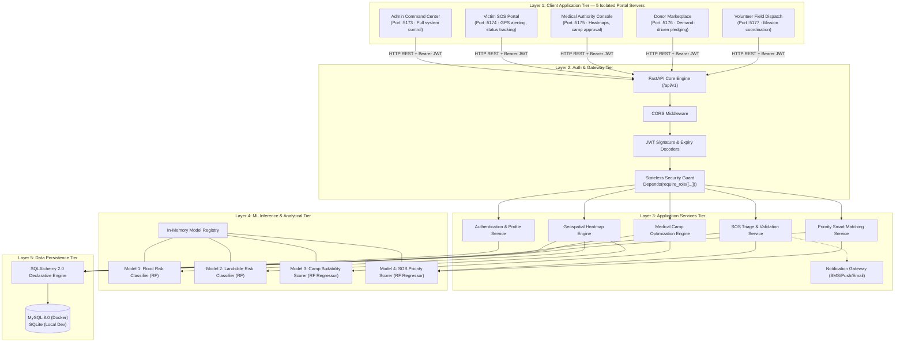
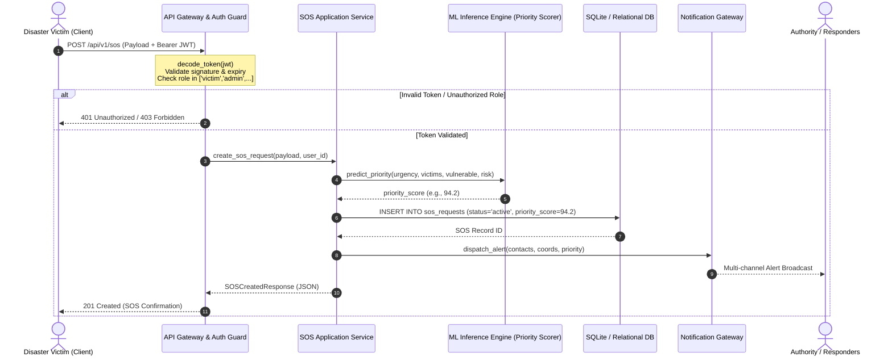

# 01. System Architecture & High-Level Design
**Project ID:** `R26-IT-047` · **Component Owner:** Kavitha · **Module:** Disaster Relief Medical Donation Module

---

## 1. Executive Architectural Overview

The Disaster Relief Medical Donation Module is engineered as a **5-tier layered micro-monolith** designed to bridge emergency alerting, spatial risk analytics, medical camp planning, and donor resource matching into an atomic, deterministic pipeline.

---

## 2. Layer-by-Layer Architectural Decomposition

### 2.1 Layer 1: Client Application Tier

The frontend is a single React 19 SPA (Vite 8 build toolchain) distributed as **five simultaneously running development servers**, each bound to a dedicated TCP port and initialized with the default role context for its target stakeholder group.

| Portal | Port | Target Stakeholder | Default Role |
| :--- | :---: | :--- | :--- |
| Admin Command Center | `:5173` | System administrators | `admin` |
| Victim SOS Portal | `:5174` | Disaster-affected members of the public | `victim` |
| Medical Authority Console | `:5175` | Ministry of Health (MOH) officials | `authority` |
| Relief Donor Marketplace | `:5176` | Aid organisations and individual donors | `donor` |
| Field Volunteer Dispatch | `:5177` | On-ground responders and rescue teams | `volunteer` |

- **Protocol:** HTTPS (or HTTP in development) with JSON payloads over REST conventions.
- **State Management:** Fully client-side token storage (`localStorage`). The client includes `Authorization: Bearer <JWT>` in all requests beyond public registration and login.
- **Portal Auto-Detection:** On startup, `detectCurrentPortal()` inspects (in order): the `VITE_PORTAL_TYPE` environment variable, `window.location.port`, `window.location.pathname`, and the `?portal=` query parameter. See [Document 08 — Frontend Architecture Guide](./08_frontend_portal_guide.md) for a full flowchart.

### 2.2 Layer 2: Auth & Gateway Tier
- **Routing Engine:** Versioned sub-routers mounted under the `/api/v1` namespace.
- **Role Verification:** Intercepts requests before reaching domain controllers. The `require_role()` dependency extracts and verifies token integrity (HMAC-SHA256 signature, expiry, algorithm conformance) and checks role authorization against the route whitelist.
- **Fail-Closed Semantics:** Unauthenticated or improperly structured tokens are rejected immediately with HTTP 401; unauthorized roles receive HTTP 403.

### 2.3 Layer 3: Application Services Tier
Encapsulates domain business logic, Pydantic input validation, and business rule orchestration:
- **`AuthService`**: Handles user provisioning, password bcrypt hashing, credential validation, and JWT token fabrication.
- **`SOSService`**: Ingests emergency alerts, calculates preliminary severity, links victim coordinates with administrative boundaries (GNDs), and invokes the priority scoring pipeline.
- **`HeatmapService`**: Blends static spatial vulnerability matrices with dynamic emergency alert density.
- **`CampService`**: Proposes temporary medical camp coordinates based on high-risk clustering, road accessibility, and proximity to unaffected critical facilities.
- **`MatchingService`**: Priority-ranks unmet medical supplies (e.g., insulin, trauma kits, clean water) and binds them with incoming donor pledges.
- **`NotificationService`**: Asynchronously coordinates emergency alerts to nearby responders (police, hospitals, designated relief contacts).

### 2.4 Layer 4: ML Inference & Analytical Tier
- **Lifecycle Management:** Pre-trained Random Forest model binaries (`.joblib`) and standardization scalers are loaded once into memory during application lifespan startup (`app.models.main:lifespan`).
- **Zero-Latency Serving:** Model inference calls are purely synchronous memory operations, eliminating disk I/O per request and preventing model reload overhead.

### 2.5 Layer 5: Data Persistence Tier
- **ORM:** SQLAlchemy 2.0 with strict foreign key constraints and type-safe Declarative Base models.
- **Storage Engine:** MySQL 8.0 (Docker, via PyMySQL driver) for containerized deployments; SQLite for local development. The engine auto-detects the scheme from `DATABASE_URL` — `mysql+pymysql://` activates connection pooling (`pool_size=10`, `pool_recycle=3600`, `pool_pre_ping=True`); `sqlite:///` activates `check_same_thread=False`. Switch between modes by editing `.env.docker` (Docker) or `backend/.env2` (local).

---

## 3. End-to-End Request Data Flow

---

## 4. Architectural Non-Functional Requirements & Design Decisions

| Metric / Attribute | Architectural Design Decision |
| :--- | :--- |
| **Stateless Authorization** | User ID and Role claims are embedded directly inside the JWT payload. Eliminates the need for a central session table or Redis round-trip per API call. |
| **Single Source of Truth** | All 3 system modules share a unified relational database. Eliminates data synchronization drift between SOS requests, heatmaps, and donation allocations. |
| **Fail-Closed Security** | Missing role claims, expired tokens, or unhandled exceptions default to immediate HTTP rejection with explicit error details. |
| **Decoupled Training vs Inference** | Training pipelines (`ml_pipeline.py`) run as standalone offline jobs producing versioned `.joblib` artifacts. Request serving never executes training routines. |
| **Extensible Schema** | Normalized schema separates `DonationItem` (demand) from `Donation` (pledge) to support partial fulfillment across multiple donors. |

---

## 5. Technology Stack Selection Matrix

| Component | Selected Technology | Evaluated Alternatives | Rationale for Selection |
| :--- | :--- | :--- | :--- |
| **Frontend Framework** | **React 19 + Vite 8** | Next.js, SvelteKit, Vue | SPA model ideal for dashboard-style role portals; Vite's port-per-process model enables clean portal isolation without a reverse proxy. |
| **UI Icon System** | **Lucide React** | Font Awesome, Material Icons, Unicode emoji | Pure SVG vector icons; fully tree-shaken, accessible, print-clean, and zero-font dependency. Eliminates all emoji characters for professional rendering. |
| **GIS Mapping** | **Leaflet + React-Leaflet** | Mapbox GL JS, Google Maps, Deck.gl | Lightweight, tile-agnostic, works offline with local tiles; no API key required for OpenStreetMap layers. |
| **Backend Web Framework** | **FastAPI (0.110.0)** | Django, Flask, Express.js | Native Pydantic schema validation, automated OpenAPI docs, high async throughput, first-class dependency injection for RBAC guards. |
| **ORM / Data Layer** | **SQLAlchemy (2.0.29)** | Django ORM, Raw SQL, Peewee | Standard enterprise Python ORM; explicit transactional control; easy transition from SQLite development to PostgreSQL production. |
| **Hashing & Cryptography** | **Bcrypt (4.1.3) + PyJWT** | PBKDF2, SHA-256, Argon2 | Bcrypt provides adaptive salt-and-hash protection with proven resistance against brute-force GPU attacks. |
| **Machine Learning** | **Scikit-Learn (1.3.2)** | PyTorch, XGBoost, LightGBM | Tabular disaster features with small-to-medium dataset sizes (43–295 records) are optimally modeled with Random Forest without overfitting or heavy GPU requirements. |
| **Model Serialization** | **Joblib (1.5.3)** | Pickle, ONNX | Optimized for large NumPy arrays and Scikit-Learn pipeline serialization. |
| **Database (Docker)** | **MySQL 8.0** | PostgreSQL, MariaDB | Production-grade RDBMS; utf8mb4 charset; PyMySQL async-safe driver. |
| **Container Runtime** | **Docker Compose v2** | Kubernetes, Podman | Single-command orchestration of MySQL + FastAPI + Adminer with health-check ordering. |
| **DB Web GUI** | **Adminer** | phpMyAdmin, DBeaver | Lightweight single-file DB browser at http://localhost:8080. |
