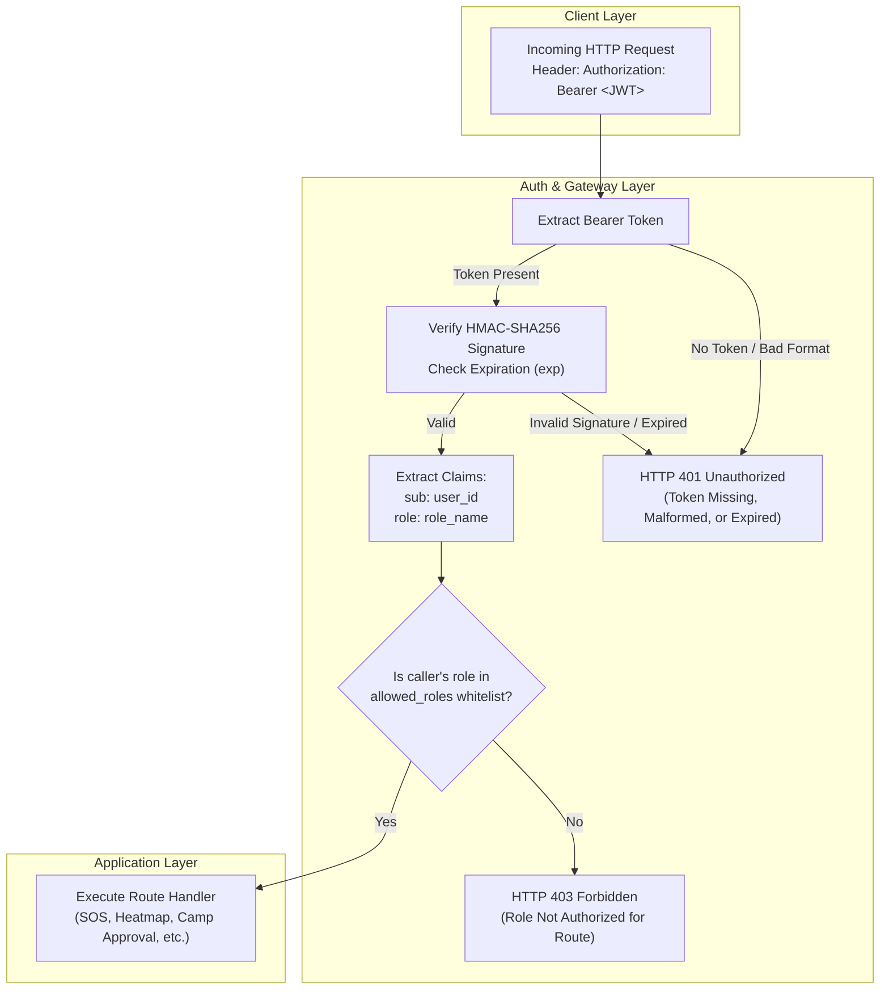
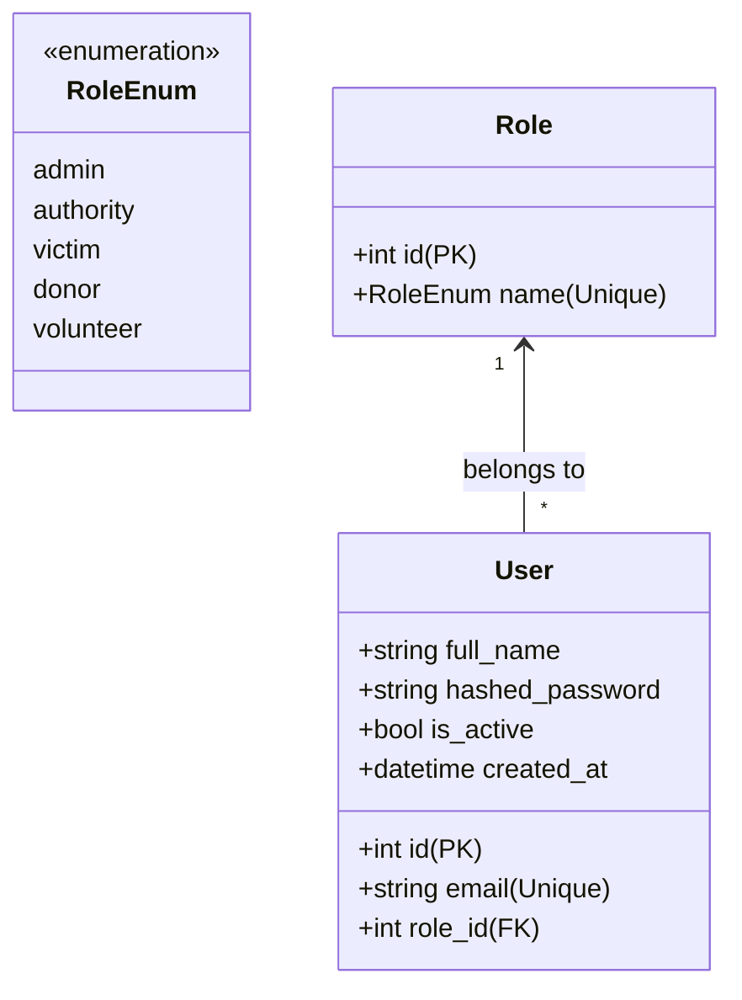
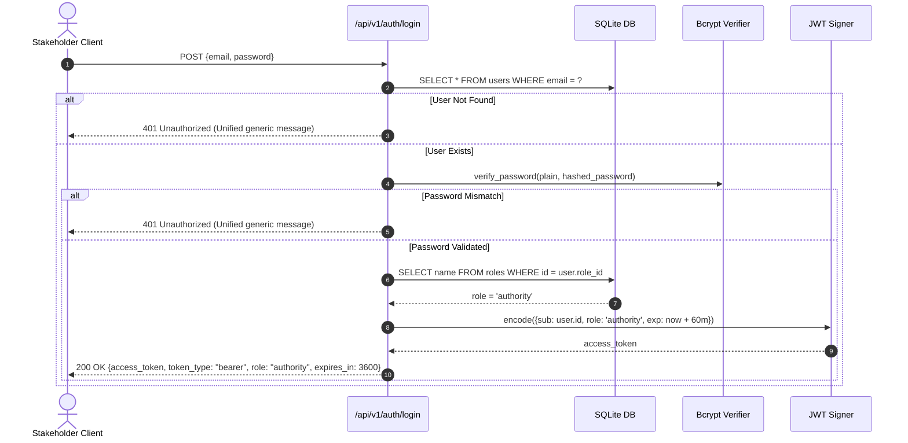

# 02. Role-Based Access Control (RBAC) & Security Specification
**Project ID:** `R26-IT-047` · **Component Owner:** Kavitha · **Module:** Disaster Relief Medical Donation Module

---

## 1. Security Architecture & Threat Model

In disaster management platforms, sensitive data—including live victim GPS coordinates, casualty counts, vulnerable-person flags, and emergency resource allocations—must be protected from unauthorized access or alteration.

The security layer resolves the primary vulnerability of unsegmented systems by implementing a **Claims-Based Stateless RBAC Model** enforced via declarative dependency injection in FastAPI.



---

## 2. System Role Definitions

The system defines **five canonical stakeholder roles** represented as an immutable enumeration in database and application layers:



| Role Code | Display Name | Assigned Scope & Responsibilities | Default on Register? |
| :--- | :--- | :--- | :---: |
| **`victim`** | Disaster Victim / Public | Can submit emergency SOS alerts, track own SOS requests, view public risk heatmaps, and view approved medical camps. | **Yes** (Automatic) |
| **`donor`** | Relief Donor | Can browse priority-sorted unmet medical donation needs and create item-level donation pledges. | No (Promoted by Admin) |
| **`authority`** | Medical Authority | Can review all active/resolved SOS alerts, run ML risk predictions, and officially approve/reject proposed medical camps. | No (Promoted by Admin) |
| **`volunteer`** | Field Volunteer / Responder | Can view active SOS triage queues and coordinate field relief distributions. | No (Promoted by Admin) |
| **`admin`** | System Administrator | Full administrative control: user role management, system health monitoring, audit logs, and master data overrides. | No (Seed / Master account) |

---

## 3. JWT Claims Specification & Token Lifecycle

### 3.1 Token Payload Structure
The system uses JSON Web Tokens (JWT) signed with the `HS256` (HMAC-SHA256) cryptographic algorithm:

```json
{
  "sub": "104",
  "role": "authority",
  "exp": 1755172800
}
```

- **`sub` (Subject):** Stringified integer ID of the authenticated user in the database.
- **`role` (Role Claim):** The string representation of the assigned `RoleEnum` at the time of token issuance.
- **`exp` (Expiration):** Unix epoch timestamp indicating when the token expires (default: 60 minutes).

### 3.2 Token Issuance Flow


---

## 4. Role-Based Access Control Matrix

The matrix below serves as the single source of truth for authorization enforcement across all API endpoints:

| Endpoint | HTTP Method | Allowed Roles | Description / Business Purpose |
| :--- | :---: | :--- | :--- |
| `/api/v1/auth/register` | `POST` | **Public** | Self-registration; assigns default `victim` role. |
| `/api/v1/auth/login` | `POST` | **Public** | Authenticates credentials; issues stateless JWT. |
| `/api/v1/auth/me` | `GET` | **All Authenticated** | Returns profile of caller identified by token. |
| `/api/v1/sos` | `POST` | `victim`, `donor`, `authority`, `volunteer`, `admin` | Submits emergency SOS alert with live GPS coordinates. |
| `/api/v1/sos/{id}` | `GET` | **Owner**, `authority`, `admin` | Returns details for a specific SOS request. |
| `/api/v1/sos` | `GET` | `authority`, `admin` | Returns list of all active/triaged SOS requests. |
| `/api/v1/heatmap` | `GET` | **All Authenticated** | Returns spatial risk polygons and live SOS intensity. |
| `/api/v1/predict/flood` | `POST` | `authority`, `admin` | Triggers Random Forest flood inference on area. |
| `/api/v1/predict/landslide` | `POST` | `authority`, `admin` | Triggers Random Forest landslide inference on area. |
| `/api/v1/camps` | `GET` | **All Authenticated** | Returns list of proposed and approved medical camps. |
| `/api/v1/camps/{id}/approve` | `PATCH` | `authority`, `admin` | Officially approves a recommended medical camp. |
| `/api/v1/donations/needs` | `GET` | `donor`, `admin` | Returns unmet medical supply needs sorted by priority. |
| `/api/v1/donations` | `POST` | `donor` | Submits a pledge against an unmet `DonationItem`. |
| `/api/v1/users` | `GET` | `admin` | Administrative listing of all system users. |
| `/api/v1/users/{id}/role` | `PATCH` | `admin` | Promotes/demotes user role (e.g., victim → authority). |

---

## 5. Implementation Pattern: Reusable `require_role` Guard

In FastAPI, route protection is declared cleanly through dependency injection without modifying handler logic:

```python
# app/core/security.py
def require_role(allowed_roles: List[str]):
    def _dependency(token: str = Depends(oauth2_scheme)) -> TokenPayload:
        token_data = decode_token(token) # Raises 401 on signature/expiry failure
        if token_data.role not in allowed_roles:
            raise HTTPException(
                status_code=status.HTTP_403_FORBIDDEN,
                detail=f"Role '{token_data.role}' is not permitted to access this resource. Required: {allowed_roles}",
            )
        return token_data
    return _dependency
```

### Route Usage Example:
```python
# app/routers/camps.py
@router.patch("/camps/{camp_id}/approve", dependencies=[Depends(require_role(["authority", "admin"]))])
def approve_medical_camp(camp_id: int, db: Session = Depends(get_db)):
    ...
```

---

## 6. Threat Mitigation Matrix

| Potential Threat / Vector | Vulnerability Description | Applied Architectural Mitigation |
| :--- | :--- | :--- |
| **Token Tampering / Role Escalation** | Attacker modifies role claim from `victim` to `admin` in client payload. | Tokens are HMAC-SHA256 signed with a high-entropy server secret (`SECRET_KEY`). Any payload tampering invalidates the signature, triggering HTTP 401. |
| **User Enumeration** | Attacker probes `/auth/login` to test whether specific emails exist. | The login endpoint returns identical HTTP 401 messages (`"Incorrect email or password."`) regardless of whether the email was not found or the password was incorrect. |
| **Stale Role Escalation** | An admin revokes a user's role, but the user continues using an existing JWT. | Access tokens have a short lifespan (60 minutes). Role changes take effect immediately upon the next token refresh or re-login. |
| **Brute-Force Password Attacks** | Dictionary/rainbow table attacks against stored password database. | Passwords are salted and hashed using **Bcrypt** with an adaptive work factor (cost 12), making GPU-assisted parallel cracking computationally prohibitive. |
