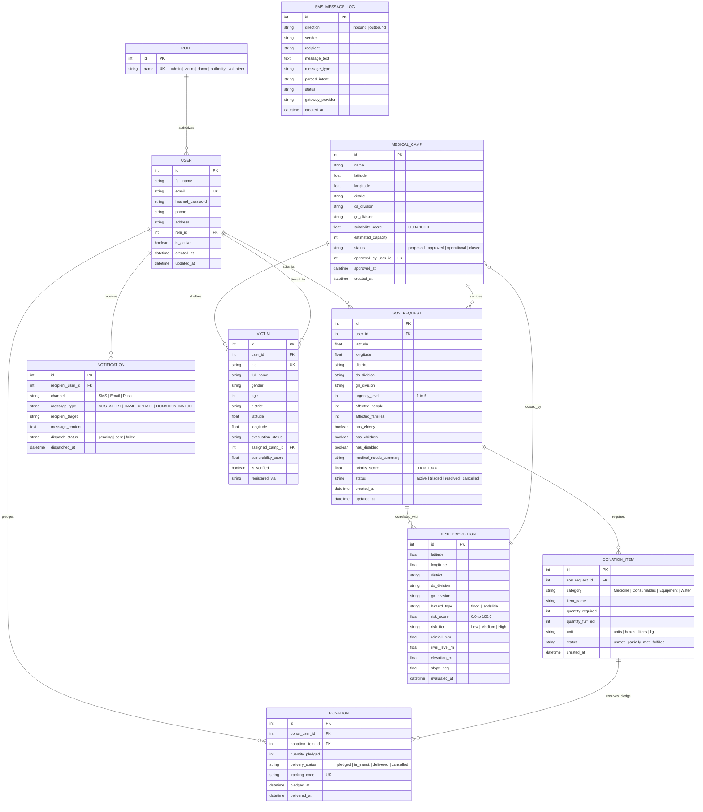

# 03. Database Schema & Data Dictionary
**Project ID:** `R26-IT-047` · **Component Owner:** Kavitha · **Module:** Disaster Relief Medical Donation Module

---

## 1. Consolidated Entity-Relationship (ER) Overview

The database model unifies emergency alerting, geospatial risk assessment, camp recommendation, and donation matching into a **normalized 10-entity relational schema**.

---

## 2. Schema Data Dictionary

### 2.1 Table: `roles`
Defines the canonical stakeholder access roles.

| Column | Data Type | Constraints | Description |
| :--- | :--- | :--- | :--- |
| `id` | `INTEGER` | `PRIMARY KEY, AUTOINCREMENT` | Unique identifier. |
| `name` | `VARCHAR(50)` | `NOT NULL, UNIQUE, INDEX` | Enum value (`admin`, `victim`, `donor`, `authority`, `volunteer`). |

---

### 2.2 Table: `users`
Represents registered human actors across all stakeholder roles.

| Column | Data Type | Constraints | Description |
| :--- | :--- | :--- | :--- |
| `id` | `INTEGER` | `PRIMARY KEY, AUTOINCREMENT` | Unique identifier. |
| `full_name` | `VARCHAR(120)` | `NOT NULL` | Full stakeholder name. |
| `email` | `VARCHAR(255)` | `NOT NULL, UNIQUE, INDEX` | Official login email. |
| `hashed_password` | `VARCHAR(255)` | `NOT NULL` | Bcrypt password hash. |
| `phone` | `VARCHAR(20)` | `NULLABLE` | Contact phone for dispatch alerting. |
| `address` | `VARCHAR(500)` | `NULLABLE` | Pre-registered home/base address. |
| `role_id` | `INTEGER` | `NOT NULL, FK -> roles.id` | Foreign key referencing assigned role. |
| `is_active` | `BOOLEAN` | `NOT NULL, DEFAULT True` | Account active flag for soft deactivation. |
| `created_at` | `DATETIME` | `NOT NULL, DEFAULT UTC_NOW` | Account registration timestamp. |
| `updated_at` | `DATETIME` | `NOT NULL, ON UPDATE UTC_NOW` | Profile update timestamp. |

---

### 2.3 Table: `sos_requests`
Primary incident entity submitted by victims during emergencies.

| Column | Data Type | Constraints | Description |
| :--- | :--- | :--- | :--- |
| `id` | `INTEGER` | `PRIMARY KEY, AUTOINCREMENT` | Unique SOS incident identifier. |
| `user_id` | `INTEGER` | `NOT NULL, FK -> users.id` | Victim who raised the emergency alert. |
| `latitude` | `FLOAT` | `NOT NULL, INDEX` | Live GPS latitude coordinate. |
| `longitude` | `FLOAT` | `NOT NULL, INDEX` | Live GPS longitude coordinate. |
| `district` | `VARCHAR(100)` | `NULLABLE, INDEX` | District name (e.g., Colombo, Nuwara Eliya). |
| `ds_division` | `VARCHAR(100)` | `NULLABLE, INDEX` | Divisional Secretariat Division (e.g., Kaduwela). |
| `gn_division` | `VARCHAR(100)` | `NULLABLE, INDEX` | Grama Niladhari Division. |
| `urgency_level` | `INTEGER` | `NOT NULL` | Victim-reported urgency (1=Mild to 5=Critical). |
| `affected_people` | `INTEGER` | `NOT NULL, DEFAULT 1` | Count of affected people in the immediate party. |
| `affected_families` | `INTEGER` | `NOT NULL, DEFAULT 1` | Count of affected family units. |
| `has_elderly` | `BOOLEAN` | `NOT NULL, DEFAULT False` | Vulnerable population flag: elderly present. |
| `has_children` | `BOOLEAN` | `NOT NULL, DEFAULT False` | Vulnerable population flag: infants/children present. |
| `has_disabled` | `BOOLEAN` | `NOT NULL, DEFAULT False` | Vulnerable population flag: mobility impaired present. |
| `medical_needs_summary` | `TEXT` | `NULLABLE` | Free-text medical description. |
| `priority_score` | `FLOAT` | `NOT NULL, DEFAULT 0.0, INDEX` | Machine learning calculated triage score (0.0–100.0). |
| `status` | `VARCHAR(30)` | `NOT NULL, DEFAULT 'active'` | Incident status (`active`, `triaged`, `resolved`, `cancelled`). |
| `created_at` | `DATETIME` | `NOT NULL, DEFAULT UTC_NOW` | Alert creation timestamp. |
| `updated_at` | `DATETIME` | `NOT NULL, ON UPDATE UTC_NOW` | Last status change timestamp. |

---

### 2.4 Table: `risk_predictions`
Persisted spatial risk scores from the Flood and Landslide Random Forest classifiers.

| Column | Data Type | Constraints | Description |
| :--- | :--- | :--- | :--- |
| `id` | `INTEGER` | `PRIMARY KEY, AUTOINCREMENT` | Unique prediction record ID. |
| `latitude` | `FLOAT` | `NOT NULL, INDEX` | Centroid latitude of evaluated zone. |
| `longitude` | `FLOAT` | `NOT NULL, INDEX` | Centroid longitude of evaluated zone. |
| `district` | `VARCHAR(100)` | `NOT NULL` | Evaluated district name. |
| `ds_division` | `VARCHAR(100)` | `NOT NULL` | Evaluated DS Division name. |
| `gn_division` | `VARCHAR(100)` | `NULLABLE` | Evaluated GN Division name. |
| `hazard_type` | `VARCHAR(30)` | `NOT NULL` | Hazard category (`flood` or `landslide`). |
| `risk_score` | `FLOAT` | `NOT NULL` | Continuous risk probability/score (0.0–100.0). |
| `risk_tier` | `VARCHAR(20)` | `NOT NULL` | Categorical risk classification (`Low`, `Medium`, `High`). |
| `rainfall_mm` | `FLOAT` | `NULLABLE` | Local rainfall measurement. |
| `river_level_m` | `FLOAT` | `NULLABLE` | Local river stage height. |
| `elevation_m` | `FLOAT` | `NULLABLE` | Elevation above sea level. |
| `slope_deg` | `FLOAT` | `NULLABLE` | Terrain slope gradient. |
| `evaluated_at` | `DATETIME` | `NOT NULL, DEFAULT UTC_NOW` | Model inference timestamp. |

---

### 2.5 Table: `medical_camps`
Proposed and authorized temporary emergency relief medical posts.

| Column | Data Type | Constraints | Description |
| :--- | :--- | :--- | :--- |
| `id` | `INTEGER` | `PRIMARY KEY, AUTOINCREMENT` | Unique camp ID. |
| `name` | `VARCHAR(150)` | `NOT NULL` | Camp name (e.g., "Kaduwela Central Relief Camp"). |
| `latitude` | `FLOAT` | `NOT NULL` | Geographic latitude. |
| `longitude` | `FLOAT` | `NOT NULL` | Geographic longitude. |
| `district` | `VARCHAR(100)` | `NOT NULL` | Administrative district. |
| `ds_division` | `VARCHAR(100)` | `NOT NULL` | Administrative DS division. |
| `gn_division` | `VARCHAR(100)` | `NULLABLE` | Administrative GN division. |
| `suitability_score`| `FLOAT` | `NOT NULL` | Model 3 calculated suitability rating (0.0–100.0). |
| `estimated_capacity`| `INTEGER` | `NOT NULL, DEFAULT 100` | Estimated patient capacity. |
| `status` | `VARCHAR(30)` | `NOT NULL, DEFAULT 'proposed'` | Camp status (`proposed`, `approved`, `operational`, `closed`). |
| `approved_by_user_id`| `INTEGER` | `NULLABLE, FK -> users.id` | Medical authority user who authorized the camp. |
| `approved_at` | `DATETIME` | `NULLABLE` | Formal approval timestamp. |
| `created_at` | `DATETIME` | `NOT NULL, DEFAULT UTC_NOW` | Camp generation timestamp. |

---

### 2.6 Table: `donation_items`
Specific itemized medical and relief requirements attached to an emergency SOS request.

| Column | Data Type | Constraints | Description |
| :--- | :--- | :--- | :--- |
| `id` | `INTEGER` | `PRIMARY KEY, AUTOINCREMENT` | Unique requirement item ID. |
| `sos_request_id` | `INTEGER` | `NOT NULL, FK -> sos_requests.id` | The parent SOS alert generating this demand. |
| `category` | `VARCHAR(50)` | `NOT NULL` | Supply category (`Medicine`, `Consumables`, `Equipment`, `Water`). |
| `item_name` | `VARCHAR(150)` | `NOT NULL` | Specific supply name (e.g., "Amoxicillin 500mg"). |
| `quantity_required` | `INTEGER` | `NOT NULL` | Total target quantity needed. |
| `quantity_fulfilled`| `INTEGER` | `NOT NULL, DEFAULT 0` | Total pledged/delivered quantity so far. |
| `unit` | `VARCHAR(30)` | `NOT NULL` | Unit of measure (`bottles`, `units`, `strips`, `liters`). |
| `status` | `VARCHAR(30)` | `NOT NULL, DEFAULT 'unmet'` | Requirement status (`unmet`, `partially_met`, `fulfilled`). |
| `created_at` | `DATETIME` | `NOT NULL, DEFAULT UTC_NOW` | Requirement creation timestamp. |

---

### 2.7 Table: `donations`
A donor's formal pledge of supplies against an active `donation_item`.

| Column | Data Type | Constraints | Description |
| :--- | :--- | :--- | :--- |
| `id` | `INTEGER` | `PRIMARY KEY, AUTOINCREMENT` | Unique donation pledge ID. |
| `donor_user_id` | `INTEGER` | `NOT NULL, FK -> users.id` | User account of the pledging donor. |
| `donation_item_id` | `INTEGER` | `NOT NULL, FK -> donation_items.id` | Item requirement being pledged against. |
| `quantity_pledged` | `INTEGER` | `NOT NULL` | Number of units pledged. |
| `delivery_status` | `VARCHAR(30)` | `NOT NULL, DEFAULT 'pledged'` | Pledge status (`pledged`, `in_transit`, `delivered`, `cancelled`). |
| `tracking_code` | `VARCHAR(64)` | `NOT NULL, UNIQUE` | Public verification code for shipment tracking. |
| `pledged_at` | `DATETIME` | `NOT NULL, DEFAULT UTC_NOW` | Pledge creation timestamp. |
| `delivered_at` | `DATETIME` | `NULLABLE` | Confirmation of delivery timestamp. |

---

### 2.8 Table: `notifications`
Audit log of all dispatched multi-channel alerts (SMS, email, push).

| Column | Data Type | Constraints | Description |
| :--- | :--- | :--- | :--- |
| `id` | `INTEGER` | `PRIMARY KEY, AUTOINCREMENT` | Unique notification log ID. |
| `recipient_user_id` | `INTEGER` | `NULLABLE, FK -> users.id` | Target registered stakeholder account (if any). |
| `channel` | `VARCHAR(20)` | `NOT NULL` | Delivery channel (`SMS`, `Email`, `Push`). |
| `message_type` | `VARCHAR(50)` | `NOT NULL` | Trigger type (`SOS_ALERT`, `CAMP_UPDATE`, `DONATION_MATCH`). |
| `recipient_target` | `VARCHAR(255)` | `NOT NULL` | Target phone number or email address. |
| `message_content` | `TEXT` | `NOT NULL` | Full text payload of dispatched alert. |
| `dispatch_status` | `VARCHAR(20)` | `NOT NULL, DEFAULT 'sent'` | Dispatch status (`pending`, `sent`, `failed`). |
| `dispatched_at` | `DATETIME` | `NOT NULL, DEFAULT UTC_NOW` | Transmission timestamp. |

---

### 2.9 Table: `victims`
Registered disaster-affected individuals with vulnerability profiling.

| Column | Data Type | Constraints | Description |
| :--- | :--- | :--- | :--- |
| `id` | `INTEGER` | `PRIMARY KEY, AUTOINCREMENT` | Unique victim record ID. |
| `user_id` | `INTEGER` | `NULLABLE, FK -> users.id` | Linked portal account (if registered). |
| `nic` | `VARCHAR(20)` | `UNIQUE, INDEX` | National Identity Card number. |
| `full_name` | `VARCHAR(150)` | `NOT NULL` | Victim's full legal name. |
| `phone` | `VARCHAR(20)` | `NOT NULL` | Primary emergency contact number. |
| `alternate_phone` | `VARCHAR(20)` | `NULLABLE` | Secondary contact number. |
| `gender` | `VARCHAR(10)` | `NOT NULL` | Gender (`male`, `female`, `other`). |
| `age` | `INTEGER` | `NOT NULL` | Age in years at time of registration. |
| `district` | `VARCHAR(100)` | `NOT NULL, INDEX` | Administrative district. |
| `ds_division` | `VARCHAR(100)` | `NOT NULL` | Divisional Secretariat division. |
| `gn_division` | `VARCHAR(100)` | `NULLABLE` | Grama Niladhari division. |
| `current_address` | `TEXT` | `NOT NULL` | Physical location at time of incident. |
| `latitude` | `FLOAT` | `NULLABLE, INDEX` | GPS latitude of victim location. |
| `longitude` | `FLOAT` | `NULLABLE, INDEX` | GPS longitude of victim location. |
| `family_members_count` | `INTEGER` | `NOT NULL, DEFAULT 1` | Total family size. |
| `children_count` | `INTEGER` | `NOT NULL, DEFAULT 0` | Number of children in household. |
| `elderly_count` | `INTEGER` | `NOT NULL, DEFAULT 0` | Number of elderly (65+) in household. |
| `disabled_count` | `INTEGER` | `NOT NULL, DEFAULT 0` | Number of disabled individuals. |
| `pregnant_lactating_count` | `INTEGER` | `NOT NULL, DEFAULT 0` | Pregnant or lactating members. |
| `evacuation_status` | `VARCHAR(50)` | `NOT NULL` | Current status (`at_risk_home`, `trapped_in_house`, `isolated_roof_level`, `evacuated_to_camp`, `missing`). |
| `assigned_camp_id` | `INTEGER` | `NULLABLE, FK -> medical_camps.id` | Assigned relief camp. |
| `chronic_diseases` | `TEXT` | `NULLABLE` | Chronic health conditions (freetext). |
| `immediate_medical_needs` | `TEXT` | `NULLABLE` | Urgent medical supply requirements. |
| `dietary_and_relief_needs` | `TEXT` | `NULLABLE` | Food, water, and non-medical relief needs. |
| `vulnerability_score` | `FLOAT` | `NULLABLE` | Computed vulnerability rating (0.0–100.0). |
| `registered_via` | `VARCHAR(50)` | `NOT NULL, DEFAULT 'web_portal'` | Registration channel (`web_portal`, `sms_gateway`, `camp_intake`, `field_officer`). |
| `is_verified` | `BOOLEAN` | `NOT NULL, DEFAULT False` | Verification status by field officer or authority. |
| `notes` | `TEXT` | `NULLABLE` | Free-text situational notes from field officers. |
| `created_at` | `DATETIME` | `NOT NULL, DEFAULT UTC_NOW` | Registration timestamp. |

---

### 2.10 Table: `sms_message_logs`
Audit trail of all inbound and outbound SMS gateway messages.

| Column | Data Type | Constraints | Description |
| :--- | :--- | :--- | :--- |
| `id` | `INTEGER` | `PRIMARY KEY, AUTOINCREMENT` | Unique message log ID. |
| `direction` | `VARCHAR(20)` | `NOT NULL` | Message direction (`inbound` or `outbound`). |
| `sender` | `VARCHAR(50)` | `NOT NULL` | Sender phone number or system identifier. |
| `recipient` | `VARCHAR(50)` | `NOT NULL` | Recipient phone number or shortcode (e.g., `1919`). |
| `message_text` | `TEXT` | `NOT NULL` | Full SMS message body. |
| `message_type` | `VARCHAR(50)` | `NULLABLE` | Classified message type (`EMERGENCY_SOS`, `SYSTEM_CONFIRMATION`, `STATUS_UPDATE`). |
| `parsed_intent` | `VARCHAR(50)` | `NULLABLE` | NLP-parsed intent (`SOS_TRIGGER`, `STATUS_QUERY`, `REGISTRATION`). |
| `status` | `VARCHAR(30)` | `NOT NULL, DEFAULT 'pending'` | Processing status (`pending`, `processed`, `delivered`, `failed`). |
| `gateway_provider` | `VARCHAR(50)` | `NULLABLE` | SMSC gateway identifier (e.g., `DIALOG_SMSC`, `MOBITEL_SMSC`). |
| `created_at` | `DATETIME` | `NOT NULL, DEFAULT UTC_NOW` | Message receipt or dispatch timestamp. |

---

## 3. Structural Design Rationales

1. **Separation of `DonationItem` and `Donation`**: A single emergency request may require large volumes of supplies (e.g., 500 units of Saline). Separating the *demand* (`donation_items`) from the *supply pledges* (`donations`) allows multiple individual donors to partially fulfill a requirement. The matching engine computes `remaining_need = quantity_required - quantity_fulfilled` atomically.
2. **Decoupling `RiskPrediction` from `SOSRequest`**: Environmental hazard risk is a regional geographic property evaluated on a grid schedule. Associating multiple SOS requests in a danger zone with a shared regional `risk_predictions` record avoids recomputing expensive geospatial models per emergency ticket.
3. **Victim Registry as Separate Entity**: The `victims` table is intentionally decoupled from `users`. Many victims are registered by field officers at camp intake without having a portal account. The nullable `user_id` FK supports both self-registered and externally-registered victims.
4. **SMS Gateway Audit Log**: The `sms_message_logs` table provides a bi-directional record of the Dialog SMSC / keyword-based SOS ingestion channel, enabling message replay, intent re-classification, and compliance auditing.

