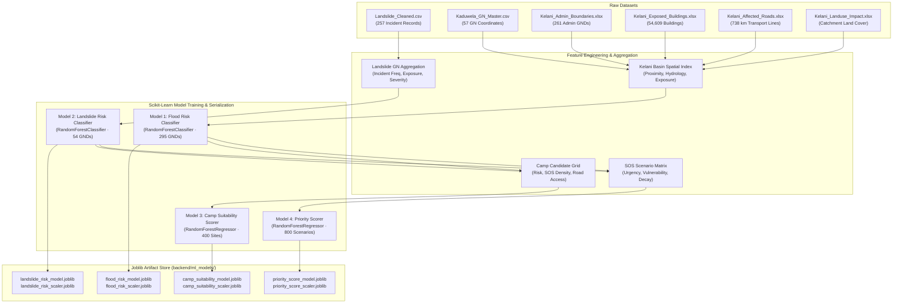

# 04. Machine Learning Pipeline & Model Specifications
**Project ID:** `R26-IT-047` · **Component Owner:** Kavitha · **Module:** Disaster Relief Medical Donation Module

---

## 1. Machine Learning Architectural Overview

The analytical core of the module utilizes **four specialized Random Forest models** designed for tabular geospatial, environmental, and emergency triage features.



---

## 2. Model 2: Landslide Risk Classifier (Verified NBRO Data)

### 2.1 Methodology & Data Provenance
- **Dataset:** [`dataset/Landslide_Cleaned.csv`](file:///D:/My%20research/SDM%20Project%20refine/dataset/Landslide_Cleaned.csv) (257 real Sri Lankan landslide incidents in Nuwara Eliya / Ambagamuwa Korale).
- **Aggregation:** Aggregated into 43 distinct Grama Niladhari (GN) division spatial clusters.
- **Target Formulation:** Severity score derived from human impact:
  $$\text{Severity} = \left(0.4 \frac{\text{People}}{\text{People}_{\max}} + 0.3 \frac{\text{Incidents}}{\text{Incidents}_{\max}} + 0.2 \frac{\text{Families}}{\text{Families}_{\max}} + 0.1 \frac{\text{MaxPeople}}{\text{MaxPeople}_{\max}}\right) \times 100$$
  Discretized into 3 balanced risk tiers:
  - **Low ($\le 17.71$)**
  - **Medium ($17.71 - 55.49$)**
  - **High ($> 55.49$)**

### 2.2 Hyperparameters & Validation
- **Algorithm:** `RandomForestClassifier(n_estimators=200, max_depth=6, class_weight='balanced', random_state=42)`
- **5-Fold Stratified Cross-Validation:**
  - **Weighted F1-Score:** $\mathbf{0.9476 \pm 0.1048}$
  - **Mean Accuracy:** $\mathbf{0.9556 \pm 0.0889}$

### 2.3 Feature Importance Breakdown
| Feature Name | Description | Importance | Visual Bar |
| :--- | :--- | :---: | :--- |
| `severity_score` | Composite human exposure rating | **32.36%** | `████████████` |
| `total_people` | Cumulative displaced population | **25.03%** | `██████████` |
| `total_families` | Cumulative displaced family units | **18.03%** | `███████` |
| `incident_count` | Historical landslide recurrence | **6.42%** | `██` |
| `max_people` | Peak casualty event in division | **5.34%** | `██` |
| `std_people` | Variance in incident severity | **4.16%** | `█` |
| `people_per_family` | Demographic density ratio | **3.29%** | `█` |
| `gn_encoded` | Encoded GN division spatial identifier | **2.04%** | ` ` |

---

## 3. Model 1: Flood Risk Classifier (Proxy Labels)

### 3.1 Methodological Transparency Disclosure
> [!IMPORTANT]
> **Honesty Statement (Proposal Section 8.2):** Since historical verified flood incident event labels from the Disaster Management Centre (DMC) were unavailable at the time of development, this model utilizes **domain-informed heuristic proxy labels**. Labels represent *modelled vulnerability* rather than unverified ground truth.

### 3.2 Feature Engineering
Synthesized from 295 spatial units across the Kelani River basin:
- **`dist_to_kelani_km` & `proximity_score`**: Haversine distance from the Kelani flood zone centroid.
- **`boggy_frac` & `water_frac`**: Catchment hydrologic surface cover proportions (from land-use surveys).
- **`river_level_proxy` & `rainfall_proxy`**: Monsoon hydrologic stage levels.
- **`is_kelani_zone`**: Binary polygon boundary indicator.

### 3.3 Evaluation Results
- **Algorithm:** `RandomForestClassifier(n_estimators=300, max_depth=8, class_weight='balanced', random_state=42)`
- **5-Fold Stratified Cross-Validation:**
  - **Weighted F1-Score:** $\mathbf{0.8694 \pm 0.0547}$
  - **Mean Accuracy:** $\mathbf{0.8712 \pm 0.0532}$
- **Held-Out Test Set Performance (20% Split, $N=59$):**
  - Precision / Recall / F1:
    - **Low:** Precision = 0.82, Recall = 0.90, F1 = 0.86 ($N=20$)
    - **Medium:** Precision = 0.89, Recall = 0.80, F1 = 0.84 ($N=20$)
    - **High:** Precision = 1.00, Recall = 1.00, F1 = 1.00 ($N=19$)
  - **Overall Accuracy:** $\mathbf{90.0\%}$

---

## 4. Model 3: Medical Camp Suitability Scorer

### 4.1 Objective & Formula
Evaluates proposed coordinates ($N=400$ candidate sites) to predict camp viability ($0.0 - 100.0$):
- Maximizes proximity to dense SOS clusters while penalizing flood/landslide exposure and lack of road access.

### 4.2 Evaluation Metrics
- **Algorithm:** `RandomForestRegressor(n_estimators=200, max_depth=8, random_state=42)`
- **Mean Absolute Error (MAE):** $\mathbf{3.125 \text{ points}}$ (on 100-point scale)
- **Coefficient of Determination ($R^2$):** $\mathbf{0.9072}$

### 4.3 Feature Importance
```text
flood_risk_score         ################# 44.21%
critical_facility_nearby ############# 34.20%
road_accessibility       ##### 14.46%
sos_density              # 2.50%
landslide_risk_score     1.59%
dist_to_kelani_km        0.85%
```

---

## 5. Model 4: SOS Priority Scorer with Time-Decay

### 5.1 Formulation
Calculates emergency response urgency for triage and donor matching. Incorporates exponential time-decay so that unaddressed alerts maintain urgency while preventing stale tickets from permanently locking relief queues:

$$\text{Priority} = \left[ 0.25 \frac{\text{Urg}}{5} + 0.15 \frac{\text{Victims}}{50} + 0.10 \frac{\text{Fam}}{20} + 0.10 \text{Elderly} + 0.08 \text{Children} + 0.05 \text{Disabled} + 0.10 \frac{\text{Meds}}{8} + 0.08 \text{Flood} + 0.05 \text{Landslide} \right] \times 100 \times e^{-0.01 t}$$

### 5.2 Evaluation Metrics
- **Algorithm:** `RandomForestRegressor(n_estimators=300, max_depth=10, random_state=42)`
- **Mean Absolute Error (MAE):** $\mathbf{4.017 \text{ points}}$
- **Coefficient of Determination ($R^2$):** $\mathbf{0.8241}$

### 5.3 Feature Importance
```text
urgency                  ######### 23.52%
affected_people          ####### 18.34%
hours_since_sos          ###### 15.32%
affected_families        #### 11.33%
has_elderly              #### 10.76%
flood_risk_score         # 4.82%
medical_needs_count      # 4.74%
has_children             # 4.44%
landslide_risk_score     # 2.92%
access_difficulty        2.49%
has_disabled             1.30%
```

---

## 6. Runtime Inference Performance

All 4 models and feature scalers are serialized as versioned binaries under [`backend/ml_models/`](file:///D:/My%20research/SDM%20Project%20refine/backend/ml_models):
- **Memory Footprint:** $\approx 13.5 \text{ MB}$ total in RAM.
- **Inference Latency:** $< 2.5 \text{ ms}$ per prediction call (zero disk I/O at runtime).
