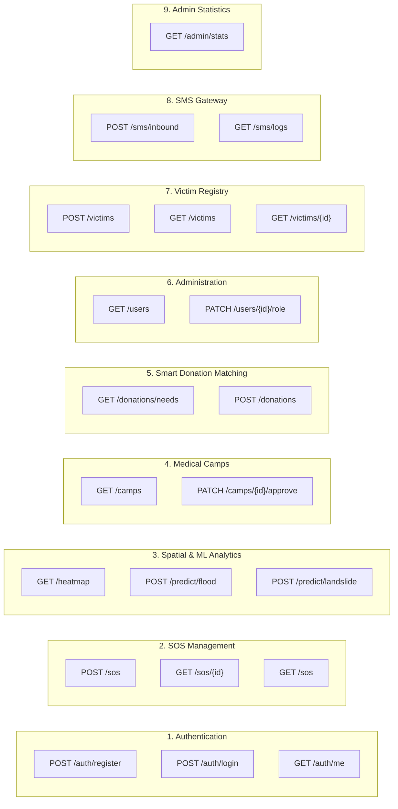

# 05. REST API Specification (OpenAPI v1)
**Project ID:** `R26-IT-047` · **Component Owner:** Kavitha · **Module:** Disaster Relief Medical Donation Module

---

## 1. Global API Conventions

- **Base URL:** `http://127.0.0.1:8000/api/v1`
- **Authentication Scheme:** `Bearer <JWT_ACCESS_TOKEN>` in HTTP `Authorization` header.
- **Content-Type:** `application/json` (unless multipart upload is specified).
- **Standard Error Response Shape:**
  ```json
  {
    "detail": "Descriptive human-readable error or list of validation failures"
  }
  ```

---

## 2. API Endpoint Inventory



---

## 3. Detailed Endpoint Reference

### 3.1 Authentication Module

#### `POST /auth/register`
Creates a new stakeholder user account. Defaults to `victim` role.
- **Access Level:** Public (Unauthenticated)
- **Request Body (`RegisterRequest`):**
  ```json
  {
    "full_name": "Kavitha Perera",
    "email": "kavitha@example.com",
    "password": "StrongPassword1",
    "phone": "+94771234567",
    "address": "12 Kandy Road, Colombo"
  }
  ```
- **Responses:**
  - `201 Created` → Returns safe `UserOut` projection (no password).
  - `409 Conflict` → Email already registered.
  - `422 Unprocessable Entity` → Password validation failed (must contain $\ge 1$ digit and letter, length $\ge 8$).

---

#### `POST /auth/login`
Authenticates credentials and issues a signed stateless JWT.
- **Access Level:** Public (Unauthenticated)
- **Request Body (`LoginRequest`):**
  ```json
  {
    "email": "kavitha@example.com",
    "password": "StrongPassword1"
  }
  ```
- **Responses:**
  - `200 OK` →
    ```json
    {
      "access_token": "eyJhbGciOiJIUzI1NiIsInR5cCI6IkpXVCJ9...",
      "token_type": "bearer",
      "expires_in": 3600,
      "role": "victim"
    }
    ```
  - `401 Unauthorized` → Incorrect email or password (unified message).

---

#### `GET /auth/me`
Fetches the profile of the caller identified by the Bearer token.
- **Access Level:** Any Authenticated User
- **Headers:** `Authorization: Bearer <JWT>`
- **Responses:**
  - `200 OK` → `UserOut` profile object.
  - `401 Unauthorized` → Token missing or expired.

---

### 3.2 Emergency SOS Module

#### `POST /sos`
Raises a real-time emergency alert with GPS coordinates and priority calculation.
- **Access Level:** `victim`, `donor`, `authority`, `volunteer`, `admin`
- **Request Body:**
  ```json
  {
    "latitude": 6.936419,
    "longitude": 79.957216,
    "district": "Colombo",
    "ds_division": "Kaduwela",
    "gn_division": "Ranala",
    "urgency_level": 5,
    "affected_people": 12,
    "affected_families": 3,
    "has_elderly": true,
    "has_children": true,
    "has_disabled": false,
    "medical_needs_summary": "Urgent insulin required for 2 elderly patients."
  }
  ```
- **Responses:**
  - `201 Created` →
    ```json
    {
      "id": 1042,
      "status": "active",
      "priority_score": 88.4,
      "created_at": "2026-08-14T07:15:00Z"
    }
    ```

---

#### `GET /sos/{id}`
Fetches the full record for a single SOS alert by its primary key.
- **Access Level:** Any authenticated role
- **Path Parameter:** `id` (integer) — SOS record identifier
- **Responses:**
  - `200 OK` → Full `SOSResponse` record including `priority_score`, `status`, GPS coordinates, and timestamps.
  - `404 Not Found` → SOS ID does not exist.

---

#### `PATCH /sos/{id}`
Updates the resolution status of an active SOS alert.
- **Access Level:** `authority`, `admin`
- **Request Body:**
  ```json
  { "status": "resolved" }
  ```
- **Valid Status Values:** `active`, `responding`, `resolved`, `closed`
- **Responses:**
  - `200 OK` → Updated SOS record.
  - `403 Forbidden` → Caller role not authorized.
  - `404 Not Found` → SOS ID does not exist.

---

#### `GET /sos`
Lists and filters all active emergency alerts for triage.
- **Access Level:** `authority`, `admin`
- **Query Parameters:** `district`, `status`, `min_priority`, `limit`, `offset`
- **Responses:**
  - `200 OK` → Array of SOS records sorted by `priority_score DESC`.
  - `403 Forbidden` → Caller role not authorized.


### 3.3 Geospatial & ML Analytics Module

#### `GET /heatmap`
Fetches spatial risk polygons, flood/landslide risk levels, and live SOS clustering.
- **Access Level:** All Authenticated Roles
- **Responses:**
  - `200 OK` → GeoJSON feature collection with risk scores and intensities.

---

#### `POST /predict/flood`
Executes Model 1 (Flood RF Classifier) on area environmental indicators.
- **Access Level:** `authority`, `admin`
- **Request Body:**
  ```json
  {
    "latitude": 6.936,
    "longitude": 79.957,
    "dist_to_kelani_km": 4.5,
    "boggy_frac": 0.08,
    "water_frac": 0.07,
    "river_level_m": 3.8,
    "rainfall_mm": 210.0,
    "is_kelani_zone": 1
  }
  ```
- **Responses:**
  - `200 OK` →
    ```json
    {
      "predicted_risk_tier": "High",
      "risk_probabilities": {"Low": 0.05, "Medium": 0.15, "High": 0.80},
      "evaluated_at": "2026-08-14T07:20:00Z"
    }
    ```

---

#### `POST /predict/landslide`
Executes Model 2 (Landslide RF Classifier) on GND incident and topographical data.
- **Access Level:** `authority`, `admin`
- **Request Body:**
  ```json
  {
    "gn_name": "Lakshapana",
    "incident_count": 5,
    "total_families": 12,
    "total_people": 48,
    "mean_families": 2.4,
    "mean_people": 9.6,
    "max_people": 22,
    "std_people": 4.1,
    "people_per_family": 4.0
  }
  ```
- **Responses:**
  - `200 OK` → Returns predicted risk tier (`Low`, `Medium`, `High`) and class probabilities.

---

### 3.4 Medical Camps Module

#### `GET /camps`
Lists proposed and operational temporary medical camps.
- **Access Level:** All Authenticated Roles
- **Responses:**
  - `200 OK` → Array of medical camp entities.

---

#### `PATCH /camps/{id}/approve`
Formally approves a recommended medical camp for deployment.
- **Access Level:** `authority`, `admin`
- **Responses:**
  - `200 OK` → Updated camp object with `status: "approved"` and approval timestamp.
  - `403 Forbidden` → Disallowed caller role.
  - `404 Not Found` → Camp ID does not exist.

---

### 3.5 Smart Donation Matching Module

#### `GET /donations/needs`
Returns itemized relief and medical requirements sorted by parent SOS priority.
- **Access Level:** `donor`, `admin`
- **Responses:**
  - `200 OK` → Priority-sorted list of unmet `DonationItem` records with remaining quantities.

---

#### `POST /donations`
Pledges supplies against an unmet demand item.
- **Access Level:** `donor`
- **Request Body:**
  ```json
  {
    "donation_item_id": 402,
    "quantity_pledged": 50
  }
  ```
- **Responses:**
  - `201 Created` → Returns donation receipt with unique `tracking_code`.

---

### 3.6 User Administration Module

#### `GET /users`
Lists all registered stakeholders and their current roles.
- **Access Level:** `admin`
- **Responses:**
  - `200 OK` → Array of `UserOut` objects.

---

#### `PATCH /users/{id}/role`
Updates a user's system role.
- **Access Level:** `admin`
- **Request Body:** `{"role": "authority"}`
- **Responses:**
  - `200 OK` → Updated user profile.
  - `400 Bad Request` → Invalid role code.
  - `403 Forbidden` → Caller is not an admin.

---

### 3.7 Notifications & Audit Log Module

#### `GET /notifications`
Returns a paginated audit trail of all dispatched emergency broadcasts.
- **Access Level:** `admin`
- **Query Parameters:** `limit` (default: 50), `offset` (default: 0), `channel` (optional: `sms`, `push`, `email`)
- **Responses:**
  - `200 OK` → Array of `NotificationLog` records ordered by `dispatched_at DESC`.
  - `403 Forbidden` → Caller is not an admin.

---

#### `POST /notifications/broadcast`
Dispatches a manual emergency broadcast to all contacts within a specified geographic radius.
- **Access Level:** `authority`, `admin`
- **Request Body:**
  ```json
  {
    "message": "FLASH FLOOD WARNING: Evacuate Kelani River Low Zones immediately.",
    "district": "Colombo",
    "radius_km": 25,
    "channels": ["sms", "push"]
  }
  ```
- **Responses:**
  - `200 OK` → Dispatch receipt with `recipients_count` and `message_id`.
  - `403 Forbidden` → Caller role not authorized.

---

### 3.8 Victim Registry Module

#### `POST /victims`
Registers a disaster-affected individual (self or field officer assisted).
- **Access Level:** `victim`, `authority`, `admin`
- **Request Body (abbreviated):**
  ```json
  {
    "nic": "200112345678",
    "full_name": "Amara Fernando",
    "phone": "+94761234567",
    "gender": "female",
    "age": 27,
    "district": "Colombo",
    "ds_division": "Kaduwela",
    "gn_division": "Ranala",
    "current_address": "78 Flood Zone Road, Ranala",
    "latitude": 6.937000,
    "longitude": 79.958000,
    "family_members_count": 3,
    "evacuation_status": "at_risk_home",
    "immediate_medical_needs": "Prenatal vitamins, clean water",
    "registered_via": "web_portal"
  }
  ```
- **Responses:**
  - `201 Created` → Returns full `VictimOut` record with `vulnerability_score`.
  - `409 Conflict` → NIC already registered.

---

#### `GET /victims`
Lists all registered victims with pagination and filtering.
- **Access Level:** `authority`, `admin`
- **Query Parameters:** `skip`, `limit`, `district`, `evacuation_status`, `is_verified`
- **Responses:**
  - `200 OK` → Array of `VictimOut` records sorted by `vulnerability_score DESC`.

---

#### `GET /victims/{id}`
Fetches a single victim's full profile and medical needs.
- **Access Level:** `victim` (own record), `authority`, `admin`
- **Responses:**
  - `200 OK` → Full `VictimOut` object.
  - `404 Not Found` → Victim ID does not exist.

---

### 3.9 SMS Gateway Module

#### `POST /sms/inbound`
Ingests an inbound SMS message from the Dialog SMSC gateway. Parses keyword-based SOS triggers (`SOS <urgency> <district> <people> <needs>`).
- **Access Level:** Public (gateway callback, no auth required)
- **Request Body:**
  ```json
  {
    "sender": "+94771234567",
    "recipient": "1919",
    "message": "SOS 5 Colombo 8 Need insulin and bandages flooding"
  }
  ```
- **Responses:**
  - `200 OK` → Parsed intent, created SOS ID (if triggered), and confirmation SMS dispatched.
  - `200 OK` (Unknown intent) → Message logged; acknowledgement sent.

---

#### `GET /sms/logs`
Returns the full bi-directional SMS gateway audit trail.
- **Access Level:** `admin`
- **Query Parameters:** `direction` (`inbound`/`outbound`), `status`, `limit`, `offset`
- **Responses:**
  - `200 OK` → Array of `SMSMessageLog` records ordered by `created_at DESC`.

---

### 3.10 Admin Statistics Module

#### `GET /admin/stats`
Returns a real-time system-wide dashboard summary for the Admin Command Center.
- **Access Level:** `admin`
- **Responses:**
  - `200 OK` →
    ```json
    {
      "total_users": 12,
      "active_sos": 3,
      "medical_camps": { "proposed": 1, "approved": 2, "operational": 1 },
      "donation_items": { "unmet": 4, "partially_met": 6, "fulfilled": 12 },
      "total_victims": 8,
      "total_donations": 15,
      "sms_logs_today": 6
    }
    ```

---


## 4. HTTP Status Code Reference

| Status Code | Meaning | Common Trigger |
| :---: | :--- | :--- |
| `200 OK` | Request successful | GET, PATCH operations returning data |
| `201 Created` | Resource created | POST /sos, POST /auth/register, POST /donations |
| `400 Bad Request` | Input validation failure | Invalid role code, malformed request body |
| `401 Unauthorized` | Token missing, expired, or invalid signature | All protected routes without valid Bearer token |
| `403 Forbidden` | Token valid but role not permitted | Victim accessing admin endpoint |
| `404 Not Found` | Resource does not exist | Unknown SOS ID, Camp ID, User ID |
| `409 Conflict` | Duplicate resource | Registering an existing email address |
| `422 Unprocessable Entity` | Pydantic schema validation error | Short password, malformed email, missing required field |
| `500 Internal Server Error` | Unhandled server exception | ML model load failure, database connectivity issue |
