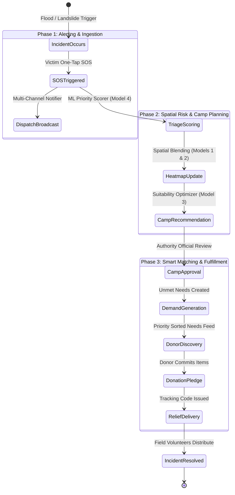
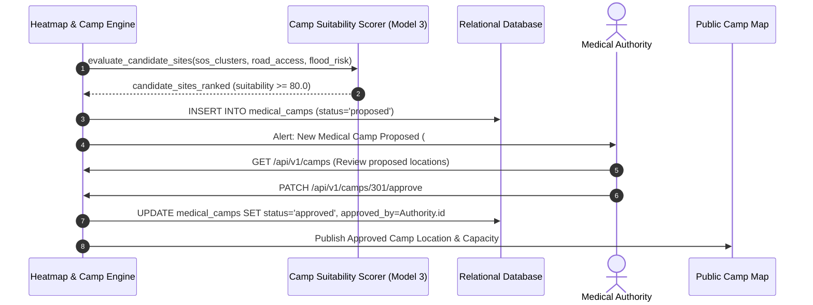
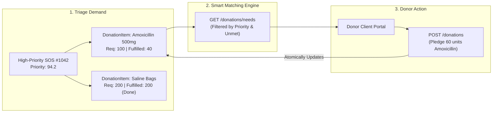

# 06. Disaster Response Operational Lifecycle
**Project ID:** `R26-IT-047` · **Component Owner:** Kavitha · **Module:** Disaster Relief Medical Donation Module

---

## 1. End-to-End Operational Workflow

The Disaster Relief Medical Donation Module connects five key stages into an automated lifecycle from emergency onset to final relief distribution.

---

## 2. Stage-by-Stage Operational Walkthrough

### 2.1 Stage 1: One-Tap Emergency SOS Alerting
1. **Victim Interaction:** A registered victim clicks the primary emergency button on the React mobile interface.
2. **Telemetry Ingestion:** The client browser captures HTML5 high-accuracy GPS coordinates (`latitude`, `longitude`) and attaches pre-registered user details.
3. **Multi-Recipient Dispatch:** The system immediately creates an `sos_requests` record and triggers alerts to up to five pre-registered emergency contacts, local relief camps, and nearest hospital dispatch desks.

---

### 2.2 Stage 2: Spatial Risk Heatmap Blending
1. **Model Evaluation:** The system evaluates the alert coordinates against the **Flood Risk Classifier (Model 1)** and **Landslide Risk Classifier (Model 2)**.
2. **Dynamic Risk Blending:** Static hazard risk scores from the GN division lookup tables are blended with real-time active SOS clustering density:
   $$\text{Heatmap Intensity}(x, y) = 0.6 \cdot \text{StaticHazardRisk}(x, y) + 0.4 \cdot \text{ActiveSOSDensity}(x, y)$$
3. **Danger Zone Broadcast:** Registered stakeholders located within a $2\text{ km}$ buffer radius of high-risk nodes receive proactive warning notifications.

---

### 2.3 Stage 3: Medical Camp Placement & Authority Approval

---

### 2.4 Stage 4: Priority Scoring & Triage
1. **Model 4 Scorer:** The `priority_score` is computed automatically upon SOS creation and re-indexed periodically using time-decay:
   - High casualties, elderly/child presence, and high local hazard scores receive immediate priority ($\ge 85.0$).
2. **Triage Queue:** Relief coordinators and medical authorities view the live triage list sorted strictly by priority score descending.

---

### 2.5 Stage 5: Demand-Driven Smart Donation Matching

1. **Itemized Demand:** Each SOS alert itemizes specific required supplies into `donation_items` records.
2. **Donor Feed:** Donors browse the public needs feed, where supplies are prioritized based on parent SOS emergency scores.
3. **Partial Fulfillment:** Donors pledge available quantities. The system tracks partial fulfillments until `quantity_fulfilled == quantity_required`, marking the item as fulfilled.
4. **Verification & Delivery:** A unique tracking hash code is issued to the donor for drop-off verification at the nearest approved medical camp.
