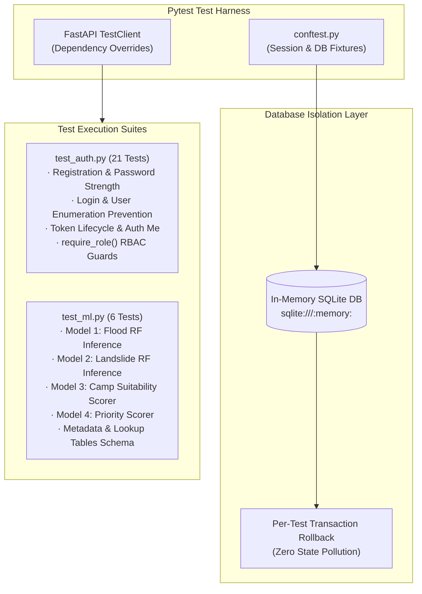

# 07. Testing & Quality Assurance Report
**Project ID:** `R26-IT-047` · **Component Owner:** Kavitha · **Module:** Disaster Relief Medical Donation Module

---

## 1. Testing Strategy & Isolation Architecture

The verification suite employs a **three-tier quality assurance framework** designed to prevent regressions across security, business logic, and analytical layers.



---

## 2. Test Cases Inventory

### 2.1 Authentication & Registration Suite (`tests/test_auth.py`)

| Test ID | Test Method Name | Scenario Tested | Expected Result | Status |
| :--- | :--- | :--- | :--- | :---: |
| `TC-AUTH-01` | `test_register_success` | Valid registration payload with required and optional fields. | `201 Created` + safe `UserOut` body (no password hash). | ✅ **PASS** |
| `TC-AUTH-02` | `test_register_default_role_is_victim` | Ensures self-registration always assigns the default `victim` role. | `201 Created` with `role: "victim"`. | ✅ **PASS** |
| `TC-AUTH-03` | `test_register_duplicate_email` | Attempting to register an email that already exists. | `409 Conflict` with clear error detail. | ✅ **PASS** |
| `TC-AUTH-04` | `test_register_weak_password_no_digit` | Password containing only letters (missing digits). | `422 Unprocessable Entity` validation error. | ✅ **PASS** |
| `TC-AUTH-05` | `test_register_short_password` | Password with length $< 8$ characters. | `422 Unprocessable Entity` validation error. | ✅ **PASS** |
| `TC-AUTH-06` | `test_register_invalid_email` | Malformed email string missing domain format. | `422 Unprocessable Entity` validation error. | ✅ **PASS** |

---

### 2.2 Login & Token Verification Suite (`tests/test_auth.py`)

| Test ID | Test Method Name | Scenario Tested | Expected Result | Status |
| :--- | :--- | :--- | :--- | :---: |
| `TC-LOG-01` | `test_login_success` | Valid email and password combination. | `200 OK` + valid Bearer JWT + role claim. | ✅ **PASS** |
| `TC-LOG-02` | `test_login_token_is_valid_jwt` | Decodes issued token with server secret to verify claims. | Valid payload with correct `sub`, `role`, and `exp`. | ✅ **PASS** |
| `TC-LOG-03` | `test_login_wrong_password` | Existing email with invalid password. | `401 Unauthorized` (unified error message). | ✅ **PASS** |
| `TC-LOG-04` | `test_login_nonexistent_email` | Non-existent user email address. | `401 Unauthorized` (unified error — no enumeration). | ✅ **PASS** |
| `TC-LOG-05` | `test_login_inactive_account` | Login attempt by a deactivated stakeholder account. | `403 Forbidden` account disabled response. | ✅ **PASS** |
| `TC-ME-01` | `test_me_with_valid_token` | Caller fetches own profile with valid Bearer token. | `200 OK` + current `UserOut` record. | ✅ **PASS** |
| `TC-ME-02` | `test_me_without_token` | Probing `/auth/me` without `Authorization` header. | `401 Unauthorized`. | ✅ **PASS** |

---

### 2.3 Role-Based Access Control (`require_role`) Suite (`tests/test_auth.py`)

| Test ID | Test Method Name | Scenario Tested | Expected Result | Status |
| :--- | :--- | :--- | :--- | :---: |
| `TC-RBAC-01` | `test_no_token_returns_401` | Protected endpoint accessed with no token header. | `401 Unauthorized`. | ✅ **PASS** |
| `TC-RBAC-02` | `test_malformed_token_returns_401` | Header contains garbage or un-parseable string. | `401 Unauthorized`. | ✅ **PASS** |
| `TC-RBAC-03` | `test_expired_token_returns_401` | Token with `exp` in the past. | `401 Unauthorized`. | ✅ **PASS** |
| `TC-RBAC-04` | `test_wrong_role_returns_403` | `victim` token hits an admin-only endpoint. | `403 Forbidden` (explicit role denial detail). | ✅ **PASS** |
| `TC-RBAC-05` | `test_correct_role_returns_200` | `admin` token hits an admin-only endpoint. | `200 OK` + handler executed. | ✅ **PASS** |
| `TC-RBAC-06` | `test_multi_role_allowed` | `donor` token accesses `['admin', 'authority', 'donor']` route. | `200 OK` + handler executed. | ✅ **PASS** |
| `TC-RBAC-07` | `test_multi_role_victim_blocked` | `victim` token accesses `['admin', 'authority', 'donor']` route. | `403 Forbidden`. | ✅ **PASS** |
| `TC-RBAC-08` | `test_authority_on_multi_role` | `authority` token accesses multi-role endpoint. | `200 OK` + handler executed. | ✅ **PASS** |

---

### 2.4 Machine Learning Inference Suite (`tests/test_ml.py`)

| Test ID | Test Method Name | Scenario Tested | Expected Result | Status |
| :--- | :--- | :--- | :--- | :---: |
| `TC-ML-01` | `test_model_files_exist` | Validates presence of all 13 `.joblib` and `.json` artifacts in `backend/ml_models/`. | All 13 files present. | ✅ **PASS** |
| `TC-ML-02` | `test_landslide_model_inference` | Loads `landslide_risk_model.joblib` and evaluates sample GN feature vector. | Returns predicted tier $\in \{0,1,2\}$ and sum of probabilities $= 1.0$. | ✅ **PASS** |
| `TC-ML-03` | `test_flood_model_inference` | Loads `flood_risk_model.joblib` and evaluates sample catchment feature vector. | Returns predicted tier $\in \{0,1,2\}$ and valid probability distribution. | ✅ **PASS** |
| `TC-ML-04` | `test_camp_suitability_model_inference`| Loads `camp_suitability_model.joblib` and predicts candidate camp score. | Returns continuous score $\in [0.0, 100.0]$. | ✅ **PASS** |
| `TC-ML-05` | `test_priority_score_model_inference` | Loads `priority_score_model.joblib` and evaluates emergency SOS scenario. | Returns continuous score $\in [0.0, 100.0]$. | ✅ **PASS** |
| `TC-ML-06` | `test_metadata_and_tables` | Verifies integrity and key consistency of `feature_metadata.json` and lookup tables. | Schema and DSD/GND count integrity validated. | ✅ **PASS** |

---

## 3. Automated Test Execution Summary

```text
============================= test session starts =============================
platform win32 -- Python 3.10.10, pytest-8.1.1, pluggy-1.6.0
rootdir: D:\My research\SDM Project refine\backend
configfile: pytest.ini
collected 27 items

tests/test_auth.py::TestRegister::test_register_success PASSED           [  3%]
tests/test_auth.py::TestRegister::test_register_default_role_is_victim PASSED [  7%]
tests/test_auth.py::TestRegister::test_register_duplicate_email PASSED   [ 11%]
tests/test_auth.py::TestRegister::test_register_weak_password_no_digit PASSED [ 14%]
tests/test_auth.py::TestRegister::test_register_short_password PASSED    [ 18%]
tests/test_auth.py::TestRegister::test_register_invalid_email PASSED     [ 22%]
tests/test_auth.py::TestLogin::test_login_success PASSED                 [ 25%]
tests/test_auth.py::TestLogin::test_login_token_is_valid_jwt PASSED      [ 29%]
tests/test_auth.py::TestLogin::test_login_wrong_password PASSED          [ 33%]
tests/test_auth.py::TestLogin::test_login_nonexistent_email PASSED       [ 37%]
tests/test_auth.py::TestLogin::test_login_inactive_account PASSED        [ 40%]
tests/test_auth.py::TestMe::test_me_with_valid_token PASSED              [ 44%]
tests/test_auth.py::TestMe::test_me_without_token PASSED                 [ 48%]
tests/test_auth.py::TestRequireRole::test_no_token_returns_401 PASSED    [ 51%]
tests/test_auth.py::TestRequireRole::test_malformed_token_returns_401 PASSED [ 55%]
tests/test_auth.py::TestRequireRole::test_expired_token_returns_401 PASSED [ 59%]
tests/test_auth.py::TestRequireRole::test_wrong_role_returns_403 PASSED  [ 62%]
tests/test_auth.py::TestRequireRole::test_correct_role_returns_200 PASSED [ 66%]
tests/test_auth.py::TestRequireRole::test_multi_role_allowed PASSED      [ 70%]
tests/test_auth.py::TestRequireRole::test_multi_role_victim_blocked PASSED [ 74%]
tests/test_auth.py::TestRequireRole::test_authority_on_multi_role PASSED [ 77%]
tests/test_ml.py::TestMLModels::test_model_files_exist PASSED            [ 81%]
tests/test_ml.py::TestMLModels::test_landslide_model_inference PASSED    [ 85%]
tests/test_ml.py::TestMLModels::test_flood_model_inference PASSED        [ 88%]
tests/test_ml.py::TestMLModels::test_camp_suitability_model_inference PASSED [ 92%]
tests/test_ml.py::TestMLModels::test_priority_score_model_inference PASSED [ 96%]
tests/test_ml.py::TestMLModels::test_metadata_and_tables PASSED          [100%]

====================== 27 passed in 16.48s =======================
```
