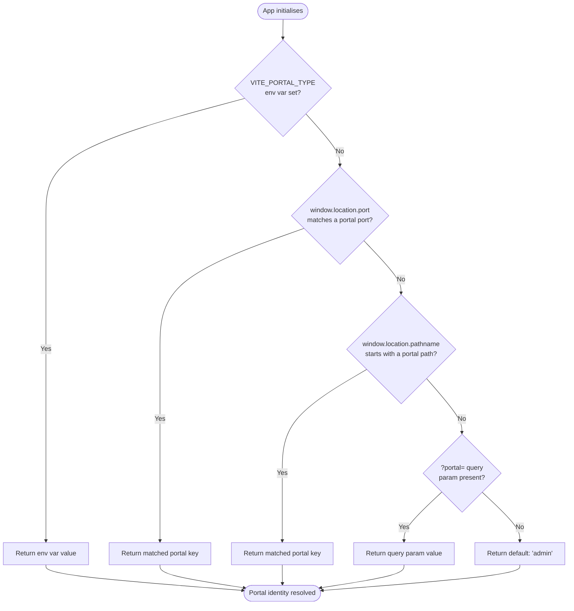
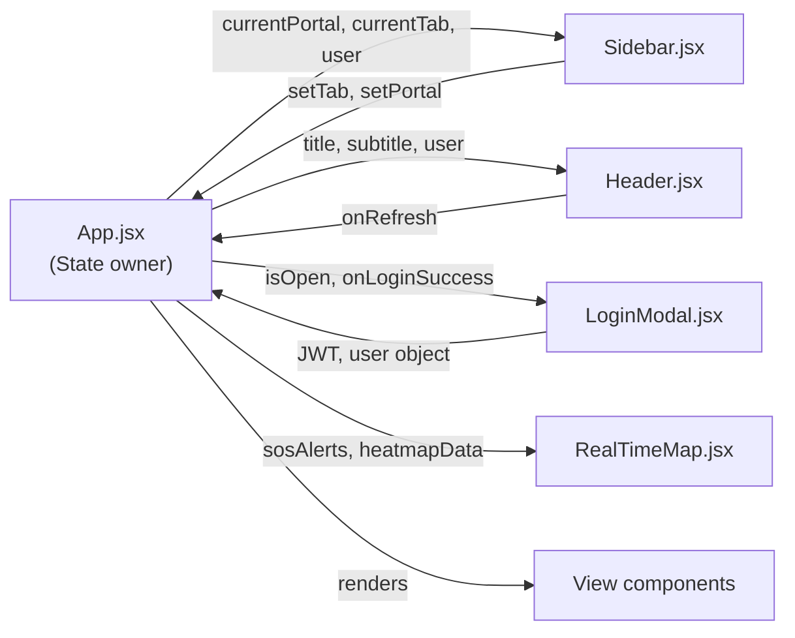
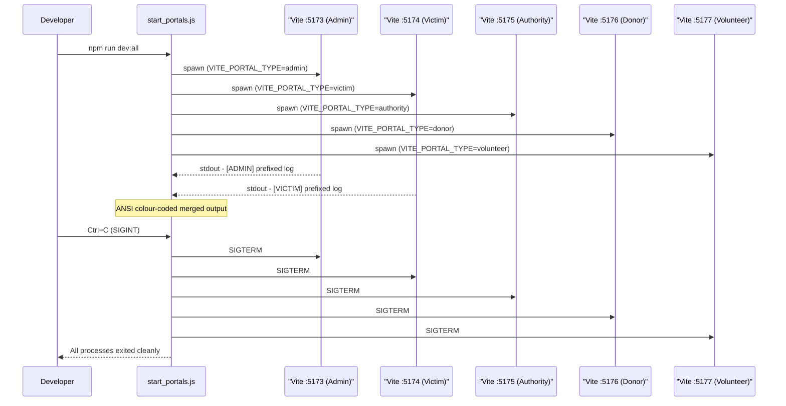

# 08. Frontend Architecture & Multi-Portal Deployment Guide

---

## 1. Executive Overview

The Disaster Relief Medical Donation Module frontend is a single React single-page application (SPA) that serves **five separate stakeholder portals**. Each portal targets a distinct audience and runs on its own dedicated TCP port, providing logical isolation without requiring five separate build artefacts. A shared codebase ensures that all portals benefit from the same component library, design system, and API integration layer.

The technology stack is:

| Layer | Technology | Version |
|---|---|---|
| UI framework | React | 19 |
| Build tool | Vite | 8 |
| Icon library | Lucide React | latest |
| Mapping | Leaflet | latest |
| Data visualisation | Chart.js | latest |
| HTTP abstraction | Custom Axios-like fetch wrapper (`api.js`) | — |

### 1.1 Portal inventory

| Portal | Audience | Port | npm Script | Default Role |
|---|---|---|---|---|
| Admin Command Center | System administrators | 5173 | `npm run dev:admin` | `admin` |
| Victim SOS Portal | Disaster-affected public | 5174 | `npm run dev:victim` | `victim` |
| Medical Authority Console | Ministry of Health (MOH) | 5175 | `npm run dev:authority` | `authority` |
| Relief Donor Marketplace | Aid organisations / donors | 5176 | `npm run dev:donor` | `donor` |
| Field Volunteer Dispatch | On-ground responders | 5177 | `npm run dev:volunteer` | `volunteer` |

Each port corresponds to a distinct entry point that is resolved at runtime by `detectCurrentPortal()` (see [Section 3](#3-portal-detection-logic)).

---

## 2. Directory Structure

All frontend source code resides under `frontend/src/`. The layout below reflects the full production tree.

```
frontend/
├── package.json                  # Scripts, dependencies
├── vite.config.js                # Shared Vite config (port injected per portal)
├── start_portals.js              # Multi-portal process spawner
├── index.html                    # Single HTML shell
└── src/
    ├── App.jsx                   # Root orchestrator — routing, auth, portal context
    ├── api.js                    # Fetch wrapper with base URL + JWT header injection
    ├── portalConfig.js           # PORTAL_CONFIG map, detectCurrentPortal(), getPortalUrl()
    ├── index.css                 # Design system tokens, glass morphism, typography
    ├── components/
    │   ├── Sidebar.jsx           # Navigation rail, portal switcher, port badge, user footer
    │   ├── Header.jsx            # Page title, live API status, refresh trigger
    │   ├── LoginModal.jsx        # JWT credential dialog with role presets
    │   └── RealTimeMap.jsx       # Leaflet map, SOS beacons, risk heatmap, GIS layers
    └── views/
        ├── OverviewView.jsx      # Dashboard KPIs, trend charts (admin)
        ├── SOSView.jsx           # SOS alert management (admin)
        ├── HeatmapView.jsx       # Geographic risk heatmap (admin, authority)
        ├── CampsView.jsx         # Relief camp registry (admin, authority, volunteer)
        ├── DonationsView.jsx     # Donation pipeline tracker (admin, donor)
        ├── UsersView.jsx         # User management (admin)
        ├── NotificationsView.jsx # System-wide notification centre (admin)
        ├── VictimPortalView.jsx  # SOS submission, status tracking (victim)
        ├── AuthorityPortalView.jsx # MOH oversight console (authority)
        ├── DonorPortalView.jsx   # Donation submission and history (donor)
        └── VolunteerPortalView.jsx # Dispatch queue, assignments (volunteer)
```

### 2.1 Key file responsibilities

| File | Responsibility |
|---|---|
| `App.jsx` | Bootstraps the application; resolves portal identity; manages JWT authentication state; auto-logs in using the portal's default credentials; renders the correct view based on `currentTab`. |
| `api.js` | Provides a thin Axios-like fetch abstraction; automatically prepends the FastAPI base URL (`http://localhost:8000`); injects the `Authorization: Bearer <token>` header from local storage on every authenticated request. |
| `portalConfig.js` | Exports `PORTAL_CONFIG` (a keyed map of port, path, default role, and display name per portal); exports `detectCurrentPortal()` and `getPortalUrl()` utility functions. |
| `index.css` | Defines all CSS custom properties (design tokens), the HSL tonal palette, glass morphism mixins, typography imports, and responsive breakpoints. |

---

## 3. Portal Detection Logic

The `detectCurrentPortal()` function in `portalConfig.js` resolves the active portal at application initialisation. It evaluates five signals in strict priority order, returning the first match.

### 3.1 Priority chain

| Priority | Signal | Source | Use case |
|---|---|---|---|
| 1 | `VITE_PORTAL_TYPE` environment variable | Build-time injection via Vite | CI/CD pipelines, Docker containers, staging environments |
| 2 | `window.location.port` matching `PORTAL_CONFIG[x].port` | Runtime browser URL | Local development — the port the developer started |
| 3 | `window.location.pathname` prefix matching `PORTAL_CONFIG[x].path` | Runtime browser URL | Reverse-proxy production deployments (e.g., `/donor/...`) |
| 4 | `?portal=` query parameter | Runtime URL query string | Manual override for testing or deep-linking |
| 5 | Default: `'admin'` | Hard-coded fallback | Unknown environments; ensures the app always renders |

### 3.2 Detection flowchart



### 3.3 `getPortalUrl()` utility

`getPortalUrl(portalKey)` constructs the full `localhost` URL for any given portal key by reading the corresponding port from `PORTAL_CONFIG`. This function powers the Sidebar's portal-switcher links, allowing users to navigate between portals in development without manually typing ports.

---

## 4. Component Reference

The `components/` directory contains four shared components consumed across multiple portals and views.

| Component | File | Props | Responsibility |
|---|---|---|---|
| Sidebar | `Sidebar.jsx` | `currentPortal`, `setPortal`, `currentTab`, `setTab`, `user`, `onLogout` | Renders the vertical navigation rail; displays the active portal name and port badge; provides a portal-switcher for cross-portal navigation; shows the authenticated user's name and role in a footer card with a logout action. |
| Header | `Header.jsx` | `title`, `subtitle`, `onRefresh`, `isRefreshing`, `user`, `onSwitchUserClick` | Displays the current view title and subtitle; shows a live API connectivity status indicator (green pulse when reachable, red when not); exposes a refresh button that triggers a data reload with a spinner animation. |
| LoginModal | `LoginModal.jsx` | `isOpen`, `onClose`, `onLoginSuccess` | Renders a full-screen modal JWT credential login dialog; provides one-click role preset buttons (Admin, Victim, Authority, Donor, Volunteer) that pre-fill credentials; on successful authentication, stores the JWT in local storage and calls `onLoginSuccess` with the user object. |
| RealTimeMap | `RealTimeMap.jsx` | `sosAlerts`, `heatmapData` | Mounts a Leaflet map centred on Sri Lanka; renders animated pulse beacons for active SOS alerts; overlays a colour-graded risk heatmap from `heatmapData`; provides GIS layer controls to toggle beacons and heatmap independently. |

### 4.1 Component interaction diagram



---

## 5. View Reference

All eleven views reside in `src/views/`. Views are pure presentational components that receive data as props from `App.jsx` and dispatch actions back via callback props.

| View | File | Accessible by roles | Purpose | Key features |
|---|---|---|---|---|
| Overview | `OverviewView.jsx` | `admin` | System-wide command dashboard | Live KPI cards (total victims, active camps, pending donations); Chart.js trend line for SOS volume over time; real-time feed of recent alerts |
| SOS Alerts | `SOSView.jsx` | `admin` | SOS alert management console | Paginated alert table with status badges; one-click status transitions (Pending → Active → Resolved); integrated `RealTimeMap` for geographic context |
| Heatmap | `HeatmapView.jsx` | `admin`, `authority` | Geographic risk visualisation | Full-viewport Leaflet heatmap; district-level risk scoring; layer toggle for population density overlay |
| Camps | `CampsView.jsx` | `admin`, `authority`, `volunteer` | Relief camp registry | Searchable camp list with occupancy gauges; camp detail panel (location, capacity, medical supplies); add/edit camp form (admin only) |
| Donations | `DonationsView.jsx` | `admin`, `donor` | Donation pipeline tracker | Donation cards with status pipeline (Submitted → Verified → Dispatched → Delivered); Chart.js doughnut for donation category breakdown; CSV export |
| Users | `UsersView.jsx` | `admin` | User account management | Role-filtered user table; account activation/deactivation toggle; role assignment controls |
| Notifications | `NotificationsView.jsx` | `admin` | System notification centre | Chronological notification feed with category filters; mark-as-read bulk action; notification composition form |
| Victim Portal | `VictimPortalView.jsx` | `victim` | SOS submission and status tracking | Guided SOS submission form with location auto-detect; live status tracker for submitted alerts; nearest camp finder |
| Authority Portal | `AuthorityPortalView.jsx` | `authority` | MOH oversight console | Aggregate medical supply metrics; camp approval workflow; authority-scoped heatmap and camp views |
| Donor Portal | `DonorPortalView.jsx` | `donor` | Donation submission and history | Donation submission form with category selection; personal donation history timeline; impact summary cards |
| Volunteer Portal | `VolunteerPortalView.jsx` | `volunteer` | Field dispatch and assignments | Assigned task queue with priority indicators; camp check-in/check-out actions; map view of assigned zones |

---

## 6. Design System

The design system is defined entirely in `src/index.css` using CSS custom properties. All components consume these tokens; no inline style values are hard-coded.

### 6.1 Typography

| Role | Font family | Usage |
|---|---|---|
| UI text | Plus Jakarta Sans | All body copy, labels, headings, button text |
| Monospace / code | JetBrains Mono | Port numbers, JWT tokens, code snippets, terminal output |

Both fonts load via Google Fonts `@import` at the top of `index.css`.

### 6.2 Color palette

The palette uses an HSL-based tonal system. Five accent families provide semantic colour across portals.

| CSS custom property | Default value | Semantic role |
|---|---|---|
| `--accent-rose` | `hsl(348, 83%, 60%)` | Danger, SOS alerts, critical indicators |
| `--accent-blue` | `hsl(217, 91%, 60%)` | Primary actions, links, authority portal theme |
| `--accent-emerald` | `hsl(152, 69%, 52%)` | Success, active status, donor portal theme |
| `--accent-amber` | `hsl(38, 92%, 58%)` | Warnings, pending status, volunteer portal theme |
| `--accent-violet` | `hsl(263, 70%, 63%)` | Admin portal accent, chart series 5 |

### 6.3 Surface and text tokens

| CSS custom property | Role |
|---|---|
| `--bg-base` | Root page background |
| `--bg-card` | Card and panel surface background |
| `--text-primary` | Primary body and heading text |
| `--text-secondary` | Muted labels, captions, placeholder text |

### 6.4 Glass morphism

Card surfaces apply a frosted-glass treatment:

```css
.card {
  background: rgba(var(--bg-card-rgb), 0.6);
  backdrop-filter: blur(12px);
  -webkit-backdrop-filter: blur(12px);
  border: 1px solid rgba(255, 255, 255, 0.08);
  border-radius: 16px;
}
```

`backdrop-filter: blur(12px)` is applied consistently to all floating card surfaces, modals, and the Sidebar.

### 6.5 Responsive breakpoints

| Breakpoint | Value | Behaviour |
|---|---|---|
| Tablet | `1024px` | Sidebar collapses to icon-only rail; grid columns reduce |
| Mobile | `768px` | Sidebar becomes a bottom sheet drawer; single-column layout |

---

## 7. Multi-Portal Startup Guide

### 7.1 Install dependencies

Run once from the `frontend/` directory:

```bash
npm install
```

This installs all portal dependencies from a single `package.json`.

### 7.2 Start an individual portal

To start a single portal in development mode, use the corresponding npm script:

```bash
npm run dev:admin      # http://localhost:5173
npm run dev:victim     # http://localhost:5174
npm run dev:authority  # http://localhost:5175
npm run dev:donor      # http://localhost:5176
npm run dev:volunteer  # http://localhost:5177
```

Each script uses `cross-env` to inject `VITE_PORTAL_TYPE` before invoking the Vite dev server on the portal's assigned port.

### 7.3 Start all portals simultaneously

```bash
npm run dev:all
```

This invokes `start_portals.js`, which spawns all five Vite child processes in parallel.

### 7.4 How `start_portals.js` works

`start_portals.js` is a plain Node.js script that:

1. Defines an array of five portal configurations, each containing a `name`, `port`, and `VITE_PORTAL_TYPE` value.
2. Calls `child_process.spawn()` for each portal, passing `cross-env VITE_PORTAL_TYPE=<x> vite --port <port>` as the command.
3. Prefixes every line of `stdout` and `stderr` from each child process with a **colour-coded label** (e.g., `[ADMIN]`, `[VICTIM]`) using ANSI escape codes, allowing all five log streams to coexist in one terminal without ambiguity.
4. Registers a `SIGINT` handler (Ctrl+C) that sends `SIGTERM` to all child processes and waits for graceful shutdown before exiting, preventing orphaned Vite dev servers.



### 7.5 Browser access URLs

| Portal | URL |
|---|---|
| Admin Command Center | http://localhost:5173 |
| Victim SOS Portal | http://localhost:5174 |
| Medical Authority Console | http://localhost:5175 |
| Relief Donor Marketplace | http://localhost:5176 |
| Field Volunteer Dispatch | http://localhost:5177 |

### 7.6 Environment variable override

In any environment where a pre-configured npm script is not available, the portal type can be forced manually:

```bash
# Unix / macOS / Git Bash
VITE_PORTAL_TYPE=donor vite

# Windows PowerShell
$env:VITE_PORTAL_TYPE="donor"; vite
```

`VITE_PORTAL_TYPE` takes the highest priority in the `detectCurrentPortal()` chain, so this override guarantees the correct portal identity regardless of port or path.

---

## 8. Design Decisions & Rationale

The following table documents key architectural decisions and the reasoning behind each.

| Decision | Option chosen | Rationale |
|---|---|---|
| **Single SPA vs. separate builds** | Single shared SPA bundle, port-based runtime routing | A single codebase eliminates code duplication across portals, ensures all portals share the same component library and bug fixes, and reduces CI/CD complexity to one build pipeline. Port-based isolation at runtime provides sufficient separation between audiences without the overhead of maintaining five independent Vite projects. |
| **`detectCurrentPortal()` priority hierarchy** | Env var → port → path → query param → default | The environment variable takes the highest priority to support CI/CD pipelines and containerised deployments where no browser URL exists. Port detection serves local development. Path-prefix detection serves reverse-proxy production deployments (e.g., nginx routing `/donor/*` to the same Vite bundle). Query-param detection serves ad-hoc testing. A hard-coded default ensures the application always renders rather than crashing on an unrecognised context. |
| **Auto-authentication on startup** | `App.jsx` auto-logs in using the portal's default credentials | During development and evaluation, requiring a manual login on every hot-reload wastes time. `App.jsx` reads the portal's `defaultRole` from `PORTAL_CONFIG` and silently authenticates against the FastAPI `/auth/token` endpoint at mount. The resulting JWT is stored in local state and used for all subsequent requests. The `LoginModal` remains available for switching to a different account. |
| **Lucide React icons** | Lucide React SVG icon set | All emoji and Unicode symbol usage was replaced with Lucide React icons to ensure consistent rendering across operating systems, full accessibility (`aria-label` support), scalability at any resolution, and legibility in printed or exported documentation. |
| **`cross-env` for per-portal npm scripts** | `cross-env` package prepended to all portal scripts | Windows PowerShell does not support the Unix `VAR=value command` inline environment variable syntax. `cross-env` provides a cross-platform `cross-env VAR=value command` syntax that works identically on Windows, macOS, and Linux, ensuring all team members can use the same `package.json` scripts regardless of their development OS. |
| **Leaflet over Google Maps / Mapbox** | Leaflet with OpenStreetMap tiles | Leaflet is open-source and tile-server-agnostic, which eliminates API key management and usage billing during academic development. OpenStreetMap tiles provide sufficient cartographic detail for Sri Lanka-scale disaster mapping. |
| **Chart.js for data visualisation** | Chart.js | Chart.js provides a lightweight, canvas-based charting API that integrates naturally with React via `useRef`/`useEffect`. Its built-in animation and responsive resize support matches the dashboard's real-time update requirements without introducing a heavier library dependency. |

---

*End of document — 08. Frontend Architecture & Multi-Portal Deployment Guide*
*Project R26-IT-047 | Component owner: Kavitha | SLIIT B.Sc. IT | August 2026*
