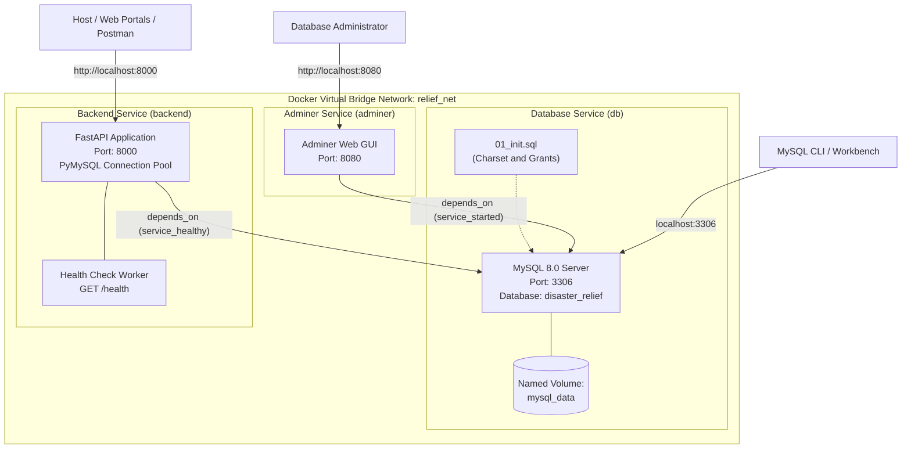

# 09. Docker Deployment & Orchestration Guide
**Project ID:** `R26-IT-047` · **Component Owner:** Kavitha · **Module:** Disaster Relief Medical Donation Module

---

## 1. Executive Overview

The Disaster Relief Medical Donation Module provides a fully containerized deployment environment powered by **Docker** and **Docker Compose**. Containerization standardizes the application environment across development, staging, and production tiers by encapsulating:
- **MySQL 8.0 Enterprise RDBMS** with automatic database provisioning, character-set configuration (`utf8mb4`), and initial schema grants.
- **FastAPI Core Backend** containerized via a multi-stage Python 3.11-slim build with non-root security execution and automated health monitoring.
- **Adminer DB Management Console** for interactive visual query inspection, schema browsing, and live database administration.



---

## 2. Containerized Architecture & Stack Details

| Service Key | Container Name | Image / Base | Exposed Port | Internal Network | Purpose |
| :--- | :--- | :--- | :---: | :--- | :--- |
| `db` | `disaster_relief_db` | `mysql:8.0` | `3306:3306` | `relief_net` | Primary relational database housing 10 core tables. |
| `backend` | `disaster_relief_backend` | `python:3.11-slim` (Multi-stage) | `8000:8000` | `relief_net` | REST API server, ML model inference, and RBAC auth. |
| `adminer` | `disaster_relief_adminer` | `adminer:latest` | `8080:8080` | `relief_net` | Web-based database management UI. |

---

## 3. Prerequisites & System Requirements

Before starting the containerized stack, ensure the following tools are installed and operational on the host system:

1. **Docker Engine & Docker Compose**:
   - Docker Engine v24.0+ or Docker Desktop v4.20+
   - Docker Compose v2.20+
2. **Windows Subsystem for Linux (WSL 2)** (for Windows hosts):
   - Virtual Machine Platform & WSL 2 enabled
   - Linux kernel update package installed
3. **Available Host TCP Ports**:
   - `8000` (FastAPI backend)
   - `3306` (MySQL server)
   - `8080` (Adminer UI)

---

## 4. WSL 2 & Docker Engine Initialization (Windows)

For Windows environments where WSL 2 is not yet initialized, an automated administrator script is provided in the repository root: [`setup_wsl_docker.ps1`](../setup_wsl_docker.ps1).

### Automated Setup via Administrator Terminal:
```powershell
# Open PowerShell as Administrator and run:
cd "D:\My research\SDM Project refine"
.\setup_wsl_docker.ps1
```

The script executes three sequential operations:
1. Enables the `VirtualMachinePlatform` Windows optional feature.
2. Enables the `Microsoft-Windows-Subsystem-Linux` feature.
3. Downloads and executes the official Microsoft WSL 2 Linux Kernel update MSI.

> [!IMPORTANT]
> A one-time computer restart is required after enabling Windows virtualization features. Following the reboot, launch Docker Desktop from the Start Menu.

---

## 5. File Inventory & Configuration Assets

The dockerized configuration comprises the following coordinated assets:

| File Path | Description | Key Configuration Directives |
| :--- | :--- | :--- |
| [`docker-compose.yml`](../docker-compose.yml) | Top-level service orchestration definition. | Healthchecks, dependency ordering, named volumes, port bindings. |
| [`.env.docker`](../.env.docker) | Environment variable definitions for container execution. | Database credentials, JWT secrets, application metadata. |
| [`backend/Dockerfile`](../backend/Dockerfile) | Multi-stage production container build for FastAPI. | Non-root `appuser`, GCC/MySQL client build tools, healthcheck probe. |
| [`backend/.dockerignore`](../backend/.dockerignore) | Build context exclusion rules. | Excludes `__pycache__`, `tests/`, `.env`, `*.db` to minimize image size. |
| [`docker/mysql/init/01_init.sql`](../docker/mysql/init/01_init.sql) | First-boot initialization SQL script. | Sets `utf8mb4` encoding and grants app privileges. |
| [`docker-start.ps1`](../docker-start.ps1) | PowerShell CLI helper for container lifecycle management. | Quick commands: `up`, `down`, `logs`, `shell`, `db-shell`, `clean`. |

---

## 6. Environment Variables Reference (`.env.docker`)

| Variable Name | Default Value | Description |
| :--- | :--- | :--- |
| `MYSQL_ROOT_PASSWORD` | `rootpassword` | Root administrative password for MySQL container. |
| `MYSQL_DATABASE` | `disaster_relief` | Target application database name created on startup. |
| `MYSQL_USER` | `relief_user` | Dedicated application user account with scoped database privileges. |
| `MYSQL_PASSWORD` | `relief_pass` | Password for `relief_user`. |
| `SECRET_KEY` | `disaster-relief-super-secret-key-change-in-production-2026` | HMAC-SHA256 signing secret for JWT access tokens. |
| `ALGORITHM` | `HS256` | Cryptographic algorithm for JWT encoding/decoding. |
| `ACCESS_TOKEN_EXPIRE_MINUTES` | `60` | Lifespan of issued JWT access tokens. |
| `APP_ENV` | `development` | Environment identifier (`development`, `staging`, `production`). |
| `APP_TITLE` | `Disaster Relief Medical Donation Module API` | OpenAPI title displayed in Swagger / ReDoc UI. |
| `APP_VERSION` | `1.0.0` | Semantic API release version. |

---

## 7. Step-by-Step Deployment Guide

### Step 1: Start All Services
Execute Docker Compose using the prepared environment configuration:

```powershell
# Standard Docker Compose command:
docker-compose --env-file .env.docker up --build -d

# Or via PowerShell helper script:
.\docker-start.ps1 up
```

### Step 2: Verify Container Health & Status
```powershell
docker-compose ps
```

*Expected output:*
```text
NAME                      IMAGE                  COMMAND                  SERVICE   STATUS                    PORTS
disaster_relief_adminer   adminer:latest         "entrypoint.sh docke…"   adminer   running                   0.0.0.0:8080->8080/tcp
disaster_relief_backend   sdm-backend            "uvicorn app.main:app…"   backend   running (healthy)         0.0.0.0:8000->8000/tcp
disaster_relief_db        mysql:8.0              "docker-entrypoint.s…"   db        running (healthy)         0.0.0.0:3306->3306/tcp
```

### Step 3: Verify Application Endpoints
| Endpoint Description | Target URL | Expected Response |
| :--- | :--- | :--- |
| **Backend Health Check** | `http://localhost:8000/health` | `{"status": "ok", "version": "1.0.0", "env": "development"}` |
| **Interactive OpenAPI (Swagger)** | `http://localhost:8000/api/docs` | Full Swagger UI interface with 30+ interactive endpoints. |
| **ReDoc Reference** | `http://localhost:8000/api/redoc` | Clean technical reference documentation. |
| **Adminer DB Console** | `http://localhost:8080` | Adminer login portal. |

---

## 8. Database Administration via Adminer

Adminer provides a lightweight browser-based SQL interface to inspect and query the live MySQL container.

### Connection Parameters:
- **System:** `MySQL`
- **Server:** `db` *(internal Docker network DNS alias)*
- **Username:** `relief_user`
- **Password:** `relief_pass`
- **Database:** `disaster_relief`

### Seeded Master Tables Verified in Database:
1. `roles` — 5 canonical roles (`admin`, `authority`, `donor`, `victim`, `volunteer`).
2. `users` — 4 pre-seeded stakeholder accounts with hashed passwords.
3. `sos_requests` — Pre-loaded disaster triage incidents with priority scores.
4. `medical_camps` — Proposed and approved relief camps.
5. `donation_items` — Itemized medical/relief supply demands.
6. `donations` — Pledged donation records with tracking codes.
7. `notifications` — Audit log of multi-channel emergency dispatches.
8. `victims` — Disaster victim registry records with vulnerability ratings.
9. `sms_message_logs` — Inbound/outbound SMS gateway records.
10. `risk_predictions` — Spatial risk evaluation cache.

---

## 9. Container Management CLI Reference (`docker-start.ps1`)

| Command | Action Performed |
| :--- | :--- |
| `.\docker-start.ps1 up` | Builds images and starts all 3 containers in detached mode. |
| `.\docker-start.ps1 down` | Gracefully stops all active project containers. |
| `.\docker-start.ps1 restart` | Performs a down and up restart sequence. |
| `.\docker-start.ps1 logs` | Streams live logs from the FastAPI backend container. |
| `.\docker-start.ps1 ps` | Displays container statuses and port health. |
| `.\docker-start.ps1 shell` | Opens an interactive `/bin/bash` shell inside the backend container. |
| `.\docker-start.ps1 db-shell` | Launches an interactive MySQL terminal as `relief_user`. |
| `.\docker-start.ps1 clean` | Stops containers and purges named volumes for a fresh state. |
| `.\docker-start.ps1 rebuild` | Executes a clean rebuild with `--no-cache`. |

---

## 10. Database Compatibility & Dual-Mode Engine Architecture

The SQLAlchemy engine configuration in [`backend/app/database.py`](../backend/app/database.py) dynamically supports both local SQLite and Docker MySQL seamlessly:

```python
# Automatic Engine Adaptation
_is_sqlite = settings.DATABASE_URL.startswith("sqlite")
_connect_args = {"check_same_thread": False} if _is_sqlite else {}
_pool_kwargs = {} if _is_sqlite else {
    "pool_size": 10,
    "max_overflow": 20,
    "pool_recycle": 3600,
    "pool_pre_ping": True,
}

engine = create_engine(
    settings.DATABASE_URL,
    connect_args=_connect_args,
    echo=False,
    **_pool_kwargs,
)
```

- **In Local Development:** Point `DATABASE_URL` to `sqlite:///./disaster_relief.db` for rapid testing with zero container overhead.
- **In Docker Deployment:** Point `DATABASE_URL` to `mysql+pymysql://relief_user:relief_pass@db:3306/disaster_relief` to leverage connection pooling and concurrency handling.

---

## 11. Troubleshooting & Diagnostics

| Symptom / Error | Root Cause | Remediation |
| :--- | :--- | :--- |
| `failed to connect to docker API` | Docker Desktop daemon is stopped or context is misconfigured. | Ensure Docker Desktop is running. Run `docker context use desktop-linux` or restart Docker. |
| `port 3306 already in use` | Local MySQL instance is bound to host port 3306. | Stop local MySQL service (`net stop MySQL80`) or map MySQL container to alternate port (e.g., `3307:3306`). |
| `backend container unhealthy` | PyMySQL driver missing or database not ready. | Verify `requirements.txt` contains `PyMySQL==1.1.0` and database healthcheck passes. |
| `access denied for relief_user` | Volume initialized before `01_init.sql` execution. | Run `.\docker-start.ps1 clean` to purge stale volume and re-trigger initialization. |

---

## 12. Production Hardening Checklist

When deploying this containerized architecture to cloud infrastructure (AWS ECS / Azure Container Apps / GCP Cloud Run):

- [ ] Rotate `SECRET_KEY` to a cryptographically secure 256-bit random string.
- [ ] Replace default MySQL credentials (`relief_pass`, `rootpassword`) with high-entropy secrets managed via AWS Secrets Manager or Vault.
- [ ] Enable TLS/SSL certificates for FastAPI via NGINX reverse proxy or cloud load balancer.
- [ ] Disable Adminer UI container in production environments or restrict access behind internal VPN.
- [ ] Configure periodic automated MySQL database snapshots with point-in-time recovery.
