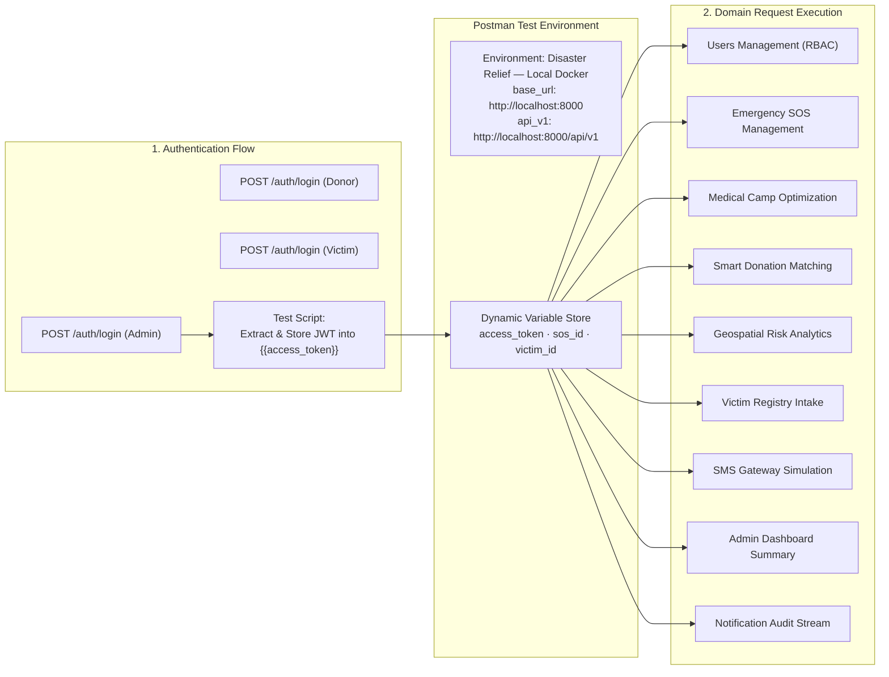

# 10. Postman API Testing & Verification Guide
**Project ID:** `R26-IT-047` · **Component Owner:** Kavitha · **Module:** Disaster Relief Medical Donation Module

---

## 1. Executive Summary & Test Suite Scope

The Disaster Relief Medical Donation Module includes a comprehensive, automated **Postman Collection (v2.1)** and dedicated **Environment Definition** covering the complete `/api/v1` RESTful interface.

The test suite validates:
- **30+ API Request Endpoints** grouped into 10 logical domain modules.
- **Stateless RBAC Token Flow** with dynamic collection variable extraction (`{{access_token}}`).
- **Automated JavaScript Test Assertions** (`pm.test()`) asserting HTTP status codes, schema shape, and payload assertions.
- **Role-Based Persona Testing** across Administrator, Medical Authority, Relief Donor, and Disaster Victim accounts.



---

## 2. Postman Asset Inventory

| Asset Name | File Location | Schema Version | Description |
| :--- | :--- | :---: | :--- |
| **Postman Collection** | [`docs/postman/Disaster_Relief_API.postman_collection.json`](./postman/Disaster_Relief_API.postman_collection.json) | v2.1.0 | 30+ structured requests with pre-written test scripts. |
| **Postman Environment** | [`docs/postman/Disaster_Relief_LocalDocker.postman_environment.json`](./postman/Disaster_Relief_LocalDocker.postman_environment.json) | v2.1.0 | Local Docker endpoints, credentials, and live variables. |

---

## 3. Import & Environment Setup Instructions

### Step 1: Import into Postman
1. Launch Postman (Desktop App or Web Client).
2. Click **Import** in the top-left navigation pane.
3. Drag & drop both JSON files from `docs/postman/` or browse to their path:
   - `docs/postman/Disaster_Relief_API.postman_collection.json`
   - `docs/postman/Disaster_Relief_LocalDocker.postman_environment.json`
4. Confirm import of **Collection** (`Disaster Relief API — R26-IT-047`) and **Environment** (`Disaster Relief — Local Docker`).

### Step 2: Select the Environment
In Postman's top-right environment selector dropdown, select:
> **Disaster Relief — Local Docker**

---

## 4. Environment Variables Reference

| Variable Key | Initial / Current Value | Type | Purpose |
| :--- | :--- | :---: | :--- |
| `base_url` | `http://localhost:8000` | String | Root URL for health probes and documentation. |
| `api_v1` | `http://localhost:8000/api/v1` | String | Base prefix for all version 1 domain endpoints. |
| `access_token` | *(auto-populated)* | Secret | Bearer JWT generated on login and used across requests. |
| `admin_email` | `admin@disaster.relief.lk` | String | Seeded Administrator login email. |
| `admin_password` | `Admin@2026!` | Secret | Seeded Administrator password. |
| `authority_email`| `authority@moh.gov.lk` | String | Seeded Medical Authority login email. |
| `authority_password` | `Authority@2026!` | Secret | Seeded Medical Authority password. |
| `donor_email` | `donor@redcross.lk` | String | Seeded Relief Donor login email. |
| `donor_password` | `Donor@2026!` | Secret | Seeded Relief Donor password. |
| `victim_email` | `victim@kaduwela.lk` | String | Seeded Disaster Victim login email. |
| `victim_password` | `Victim@2026!` | Secret | Seeded Disaster Victim password. |
| `adminer_url` | `http://localhost:8080` | String | Web URL for Adminer database browser. |

---

## 5. Token Extraction & Automated Authentication Workflow

When executing `POST /auth/login — Admin`, the Postman **Tests script** automatically captures the returned JWT access token and persists it directly into the collection variables:

```javascript
// Postman Tests Script on POST /api/v1/auth/login
pm.test("Status code is 200 OK", function () {
    pm.response.to.have.status(200);
});

const responseData = pm.response.json();
pm.test("Response includes access_token", function () {
    pm.expect(responseData).to.have.property("access_token");
    pm.expect(responseData.token_type).to.eql("bearer");
});

// Auto-save token for subsequent requests
pm.collectionVariables.set("access_token", responseData.access_token);
console.log("Captured JWT Bearer Token:", responseData.access_token.substring(0, 25) + "...");
```

All downstream protected endpoints automatically declare the Authorization header:
```text
Authorization: Bearer {{access_token}}
```

---

## 6. Complete API Test Matrix & Assertion Inventory

| Folder Module | Request Name | HTTP Method | Route Path | Access Role Required | Automated Assertion Validated |
| :--- | :--- | :---: | :--- | :--- | :--- |
| **🏥 Health** | Liveness Probe | `GET` | `/health` | Public | Status 200, `status == "ok"`, version string matches. |
| **🔐 Auth** | Register User | `POST` | `/auth/register` | Public | Status 200/201, returns safe `UserOut` without password. |
| **🔐 Auth** | Login (Admin) | `POST` | `/auth/login` | Public | Status 200, extracts `access_token` into collection state. |
| **🔐 Auth** | Login (Donor) | `POST` | `/auth/login` | Public | Status 200, returns valid donor JWT. |
| **🔐 Auth** | Login (Victim) | `POST` | `/auth/login` | Public | Status 200, returns valid victim JWT. |
| **🔐 Auth** | Current Profile | `GET` | `/auth/me` | All Authenticated | Status 200, asserts profile `email` matches token `sub`. |
| **👥 Users** | List All Users | `GET` | `/users` | `admin` | Status 200, response is array, length $\ge 4$. |
| **👥 Users** | Get User by ID | `GET` | `/users/1` | `admin` | Status 200, asserts `id == 1`. |
| **👥 Users** | Update User Role | `PATCH` | `/users/5/role` | `admin` | Status 200, asserts role updated to `"volunteer"`. |
| **🆘 SOS** | Create SOS Alert | `POST` | `/sos` | All Authenticated | Status 200/201, returns `priority_score`, stores `sos_id`. |
| **🆘 SOS** | List SOS Alerts | `GET` | `/sos?status=active` | `authority`, `admin` | Status 200, asserts sorted by priority descending. |
| **🆘 SOS** | Get SOS Details | `GET` | `/sos/1` | All Authenticated | Status 200, validates coordinates and medical needs. |
| **🆘 SOS** | Update Status | `PATCH` | `/sos/1/status` | `authority`, `admin` | Status 200, status changes to `"resolved"`. |
| **🏕️ Camps** | Create Camp | `POST` | `/camps` | `authority`, `admin` | Status 200/201, generates candidate camp site. |
| **🏕️ Camps** | List Camps | `GET` | `/camps` | All Authenticated | Status 200, array of approved and proposed camps. |
| **🏕️ Camps** | Approve Camp | `PATCH` | `/camps/1/status` | `authority`, `admin` | Status 200, status becomes `"approved"`. |
| **💊 Donations** | List Unmet Needs | `GET` | `/donations` | `donor`, `admin` | Status 200, returns itemized supplies with quantities. |
| **💊 Donations** | Pledge Donation | `POST` | `/donations` | `donor` | Status 200/201, returns tracking code and receipt. |
| **💊 Donations** | Smart Match AI | `GET` | `/donations/smart-match`| `authority`, `admin` | Status 200, computes optimal supply-to-SOS distribution. |
| **🗺️ Heatmap** | Spatial Risk Map | `GET` | `/heatmap` | All Authenticated | Status 200, GeoJSON feature array with risk scores. |
| **🗺️ Heatmap** | ML Predictions | `GET` | `/heatmap/predictions` | `authority`, `admin` | Status 200, returns raw ML inference cache. |
| **🧍 Victims** | Register Victim | `POST` | `/victims` | All Authenticated | Status 200/201, returns `vulnerability_score`. |
| **🧍 Victims** | List Victims | `GET` | `/victims` | `authority`, `admin` | Status 200, paginated victim intake records. |
| **🧍 Victims** | Get Victim ID | `GET` | `/victims/1` | `authority`, `admin` | Status 200, asserts NIC and medical history present. |
| **📱 SMS** | Inbound SOS SMS | `POST` | `/sms/inbound` | Public | Status 200, parses intent, triggers emergency SOS. |
| **📱 SMS** | SMS Gateway Logs| `GET` | `/sms/logs` | `admin` | Status 200, audit stream of incoming/outgoing SMS. |
| **📊 Admin** | Dashboard Stats | `GET` | `/admin/stats` | `admin` | Status 200, aggregate summary of all 10 system tables. |
| **🔔 Alerts** | Notifications | `GET` | `/notifications` | All Authenticated | Status 200, lists recent emergency dispatch events. |

---

## 7. Recommended Test Execution Sequence

To ensure referential dependencies are satisfied, execute collection requests in the following canonical sequence:

```text
1. 🏥 Health Check -> GET /health
2. 🔐 Auth -> POST /auth/login — Admin (Captures Admin Token)
3. 🔐 Auth -> GET /auth/me (Validates Token Claims)
4. 📊 Admin Stats -> GET /admin/stats (Initial Baseline)
5. 👥 Users -> GET /users (Verifies 4 Seeded Accounts)
6. 🆘 SOS Alerts -> POST /sos (Submits New Emergency Ticket)
7. 🆘 SOS Alerts -> GET /sos (Verifies Ticket Appears in Queue)
8. 🏕️ Medical Camps -> GET /camps (Inspects Candidate Sites)
9. 🏕️ Medical Camps -> PATCH /camps/1/status (Approves Proposed Camp)
10. 💊 Donations -> GET /donations (Browses Unmet Medical Needs)
11. 🔐 Auth -> POST /auth/login — Donor (Captures Donor Token)
12. 💊 Donations -> POST /donations (Pledges Supplies with Tracking Code)
13. 🧍 Victims -> POST /victims (Registers Displaced Household)
14. 📱 SMS Gateway -> POST /sms/inbound (Simulates Keyword SOS over SMS)
15. 📱 SMS Gateway -> GET /sms/logs (Audits SMS Inbound/Outbound Cycle)
16. 🗺️ Heatmap -> GET /heatmap (Validates Spatial Risk Polygons)
17. 📊 Admin Stats -> GET /admin/stats (Verifies Metrics Increment)
```

---

## 8. Automated Test Execution via Newman CLI

For Continuous Integration (CI/CD) pipelines, the collection can be executed headlessly using **Newman**:

```powershell
# Install Newman globally:
npm install -g newman

# Run the complete test suite:
newman run "docs/postman/Disaster_Relief_API.postman_collection.json" `
  -e "docs/postman/Disaster_Relief_LocalDocker.postman_environment.json" `
  --reporters cli,junit `
  --reporter-junit-export "test-results.xml"
```

---

## 9. Troubleshooting Test Failures

| Error Code | Potential Cause | Fix / Remediation |
| :--- | :--- | :--- |
| `401 Unauthorized` | `access_token` variable is empty or expired. | Re-run `POST /auth/login — Admin` to refresh the collection token. |
| `403 Forbidden` | Route requires `admin` or `authority`, but current token is `victim` or `donor`. | Authenticate with the appropriate role login request before hitting the endpoint. |
| `ECONNREFUSED` | FastAPI container or local uvicorn is not running. | Verify `docker-compose ps` shows `disaster_relief_backend` as running and healthy. |
| `422 Unprocessable Entity` | Request body schema validation error. | Check that JSON types (e.g., numbers for `latitude`/`longitude`) match OpenAPI specs. |
