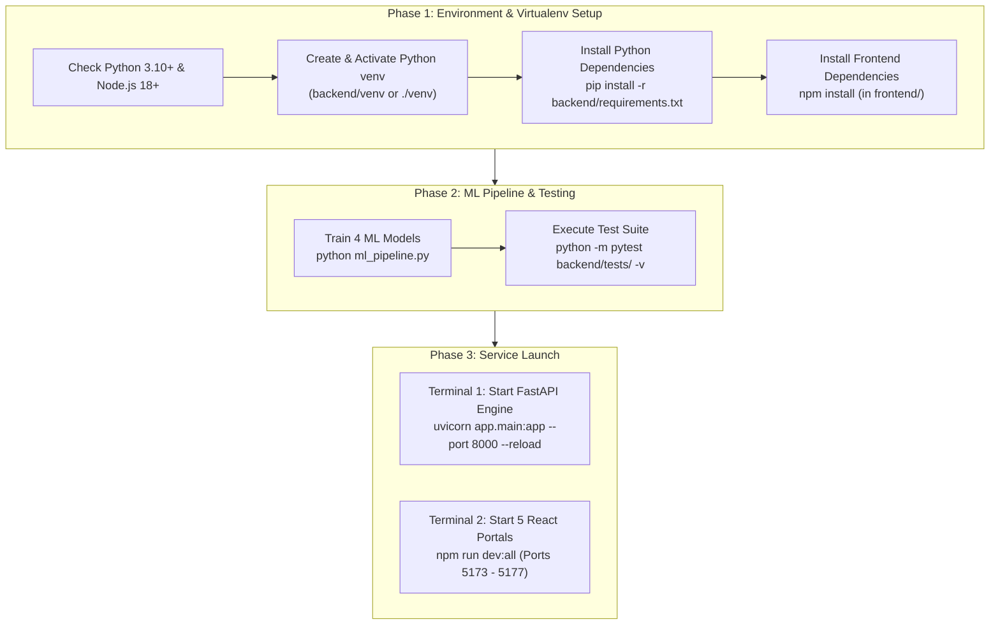

# 11. Developer Launching & Local Environment Setup Guide
**Project ID:** `R26-IT-047` · **Component Owner:** Kavitha · **Module:** Disaster Relief Medical Donation Module

---

## 1. Executive Overview

This document provides a comprehensive, step-by-step developer onboarding and execution guide for the **Disaster Relief Medical Donation Module**. It guides engineers through creating and activating Python Virtual Environments (`venv`), installing backend and frontend dependencies, training the machine learning pipeline, running automated regression test suites, and launching both the FastAPI backend engine and the five dedicated React frontend stakeholder portals.



---

## 2. System Prerequisites

Ensure your host environment meets the minimum version specifications before starting local development:

| Component | Minimum Version | Recommended Version | Verification Command |
| :--- | :--- | :--- | :--- |
| **Python** | 3.10.x | 3.11.x or 3.12.x | `python --version` |
| **Node.js** | 18.x LTS | 20.x+ LTS | `node --version` |
| **npm** | 9.x | 10.x+ | `npm --version` |
| **Git** | 2.30+ | Latest | `git --version` |
| **OS** | Windows 10/11, macOS, or Ubuntu 22.04+ | Windows 11 / WSL2 | — |

---

## 3. Python Virtual Environment (`venv`) Management

Using an isolated Python virtual environment ensures that the project's dependencies (FastAPI, SQLAlchemy, scikit-learn, PyJWT, etc.) do not conflict with host-wide Python packages.

### 3.1 Creating a Fresh Virtual Environment

If a virtual environment does not already exist, create one in the `backend/` directory (or workspace root):

```powershell
# Navigate to the backend directory
cd "D:\My research\SDM Project refine\backend"

# Create a virtual environment named 'venv'
python -m venv venv
```

---

### 3.2 Activating the Virtual Environment

Always activate the virtual environment in every terminal session before running Python scripts, training models, or launching the FastAPI backend.

#### Windows (PowerShell) — *Recommended*

```powershell
# From workspace root:
.\backend\venv\Scripts\Activate.ps1

# OR if you are already inside the backend directory:
cd "D:\My research\SDM Project refine\backend"
.\venv\Scripts\Activate.ps1
```

> [!IMPORTANT]
> **PowerShell Script Execution Policy Error Fix:**  
> If PowerShell displays `File ...\Activate.ps1 cannot be loaded because running scripts is disabled on this system`, run this command in your PowerShell session to bypass the restriction for the current process:
> ```powershell
> Set-ExecutionPolicy -Scope Process -ExecutionPolicy Bypass
> .\venv\Scripts\Activate.ps1
> ```

#### Windows (Command Prompt - `cmd.exe`)

```cmd
cd "D:\My research\SDM Project refine\backend"
venv\Scripts\activate.bat
```

#### macOS / Linux / WSL / Git Bash

```bash
cd "D:/My research/SDM Project refine/backend"
source venv/bin/activate
```

---

### 3.3 Verifying Virtual Environment Activation

When activated, your shell prompt will show the `(venv)` prefix. You can verify the active Python interpreter path:

```powershell
# Windows PowerShell:
Get-Command python | Select-Object -ExpandProperty Source

# Linux / macOS / Git Bash:
which python

# Cross-platform Python check:
python -c "import sys; print(sys.prefix)"
```

*Expected output should point to the `venv` directory inside your project folder.*

---

### 3.4 Deactivating the Virtual Environment

When you are done with your development session:

```powershell
deactivate
```

---

## 4. Dependency Installation

### 4.1 Backend Python Packages

With your `(venv)` activated, upgrade `pip` and install all required packages:

```powershell
# Ensure venv is active
cd "D:\My research\SDM Project refine\backend"

# Upgrade pip to latest version
python -m pip install --upgrade pip

# Install project dependencies
pip install -r requirements.txt
```

> [!NOTE]
> The dependencies include:
> - **Core API:** `fastapi`, `uvicorn[standard]`, `pydantic`, `pydantic-settings`
> - **Database:** `sqlalchemy`, `pymysql`, `cryptography`
> - **Security & RBAC:** `python-jose[cryptography]`, `passlib[bcrypt]`, `bcrypt`, `email-validator`
> - **ML Inference:** `scikit-learn`, `joblib`, `numpy`
> - **Testing:** `pytest`, `pytest-asyncio`, `httpx`

---

### 4.2 Frontend Node Packages

In a separate terminal (or after backend setup), install the React application dependencies:

```powershell
cd "D:\My research\SDM Project refine\frontend"
npm install
```

---

## 5. Machine Learning Pipeline Execution

Before starting the API server for the first time, generate the four machine learning model artifacts. The pipeline reads training datasets from `dataset/` and exports trained scikit-learn models into `backend/ml_models/`.

```powershell
# Ensure venv is active
cd "D:\My research\SDM Project refine"

# Execute ML training & export pipeline
python ml_pipeline.py
```

### Generated Artifacts Verification:

Check that the following files are populated in `backend/ml_models/`:

| Artifact File | Model Type | Description |
| :--- | :--- | :--- |
| `flood_model.joblib` | Random Forest Classifier | Classifies river basin flood risk levels |
| `landslide_model.joblib` | Random Forest Classifier | 3-tier landslide severity prediction |
| `camp_model.joblib` | Random Forest Regressor | Evaluates optimal medical camp placement scores |
| `priority_model.joblib` | Random Forest Regressor | Real-time SOS triage urgency scoring |
| `*.json` | Metadata Files | Feature names, class labels, and evaluation metrics |

---

## 6. Environment Configuration (`.env`)

The backend reads configuration settings from `backend/.env`. A default local configuration is already provided:

```ini
# backend/.env
SECRET_KEY=disaster-relief-super-secret-key-change-in-production-2026
ALGORITHM=HS256
ACCESS_TOKEN_EXPIRE_MINUTES=60
DATABASE_URL=sqlite:///./disaster_relief.db
APP_ENV=development
APP_TITLE=Disaster Relief Medical Donation Module API
APP_VERSION=1.0.0
```

> [!TIP]
> For local development, SQLite (`sqlite:///./disaster_relief.db`) runs with zero configuration and requires no external database service. The database schema and seed data are created automatically when the FastAPI application starts.

---

## 7. Automated Test Suite Execution

Verify backend integrity and RBAC rules by executing the automated pytest test suite:

```powershell
# Ensure venv is active
cd "D:\My research\SDM Project refine\backend"

python -m pytest tests/ -v
```

### Expected Test Results:

```text
============================= test session starts =============================
collected 27 items

tests/test_auth.py::test_register_success PASSED                         [  3%]
tests/test_auth.py::test_register_default_role_is_victim PASSED          [  7%]
tests/test_auth.py::test_register_duplicate_email PASSED                 [ 11%]
...
tests/test_ml.py::test_flood_prediction_model PASSED                     [ 88%]
tests/test_ml.py::test_landslide_prediction_model PASSED                 [ 92%]
tests/test_ml.py::test_camp_suitability_model PASSED                     [ 96%]
tests/test_ml.py::test_priority_scorer_model PASSED                      [100%]

======================== 27 passed in ~16.20s =========================
```

---

## 8. Launching the Services (Dual-Terminal Workflow)

For standard local development, open **two separate terminal windows**.

### Terminal 1: Launch FastAPI Backend Server

```powershell
# 1. Navigate to backend directory
cd "D:\My research\SDM Project refine\backend"

# 2. Activate virtual environment
.\venv\Scripts\Activate.ps1

# 3. Start Uvicorn ASGI server with live reloading
python -m uvicorn app.main:app --host 127.0.0.1 --port 8000 --reload
```

#### Verification Endpoints:
- 🌐 **Interactive OpenAPI Docs (Swagger):** [http://127.0.0.1:8000/api/docs](http://127.0.0.1:8000/api/docs)
- 📖 **ReDoc Technical Specification:** [http://127.0.0.1:8000/api/redoc](http://127.0.0.1:8000/api/redoc)
- ❤️ **Liveness Health Probe:** [http://127.0.0.1:8000/health](http://127.0.0.1:8000/health) (`{"status": "ok"}`)

---

### Terminal 2: Launch Frontend Stakeholder Portals

```powershell
# 1. Navigate to frontend directory
cd "D:\My research\SDM Project refine\frontend"

# 2. Launch all 5 portals simultaneously
npm run dev:all
```

> [!TIP]
> `npm run dev:all` executes `start_portals.js`, which spawns all five independent Vite development servers concurrently with distinct terminal color labels and unified graceful shutdown (`Ctrl+C`).

#### Individual Portal Launch Option:
If you only need to work on a specific portal, you can run its dedicated script:

```powershell
npm run dev:admin      # Port 5173 - Admin Command Center
npm run dev:victim     # Port 5174 - Victim SOS Portal
npm run dev:authority  # Port 5175 - Medical Authority Console
npm run dev:donor      # Port 5176 - Relief Donor Marketplace
npm run dev:volunteer  # Port 5177 - Field Volunteer Dispatch
```

---

## 9. Portal Access & Seeded Credentials Matrix

The local database is seeded with initial test accounts for each stakeholder role.

| Stakeholder Portal | URL | Default Login Email | Password | Assigned Role |
| :--- | :--- | :--- | :--- | :--- |
| **Admin Command Center** | [http://localhost:5173](http://localhost:5173) | `admin@disaster.relief.lk` | `Admin@2026!` | `admin` |
| **Victim SOS Portal** | [http://localhost:5174](http://localhost:5174) | `victim@kaduwela.lk` | `Victim@2026!` | `victim` |
| **Medical Authority Console** | [http://localhost:5175](http://localhost:5175) | `authority@moh.gov.lk` | `Authority@2026!` | `authority` |
| **Relief Donor Marketplace** | [http://localhost:5176](http://localhost:5176) | `donor@redcross.lk` | `Donor@2026!` | `donor` |
| **Field Volunteer Dispatch** | [http://localhost:5177](http://localhost:5177) | `volunteer@relief.lk` | `Volunteer@2026!` | `volunteer` |

---

## 10. Complete Developer Quick-Reference Sheet

For day-to-day work, copy and paste this quick sequence:

```powershell
# ==========================================
# Terminal 1: Backend API
# ==========================================
cd "D:\My research\SDM Project refine\backend"
.\venv\Scripts\Activate.ps1
python -m uvicorn app.main:app --host 127.0.0.1 --port 8000 --reload

# ==========================================
# Terminal 2: Frontend Portals
# ==========================================
cd "D:\My research\SDM Project refine\frontend"
npm run dev:all
```

---

## 11. Troubleshooting & Common Issues

### 1. `Activate.ps1 cannot be loaded because running scripts is disabled`
- **Cause:** PowerShell security policy disables execution of unsigned local scripts by default.
- **Resolution:** Run `Set-ExecutionPolicy -Scope Process -ExecutionPolicy Bypass` in the current terminal, then retry `.\venv\Scripts\Activate.ps1`.

### 2. `ModuleNotFoundError: No module named 'fastapi'` (or similar)
- **Cause:** Command was executed outside the virtual environment or packages were not installed in the active venv.
- **Resolution:** Verify `(venv)` prefix in prompt, run `python -m pip install -r backend/requirements.txt`.

### 3. `Port 8000 is already in use`
- **Cause:** An earlier Uvicorn process or another service is bound to port 8000.
- **Resolution:**
  ```powershell
  # Find process using port 8000:
  Get-NetTCPConnection -LocalPort 8000 | Select-Object OwningProcess
  # Terminate process:
  Stop-Process -Id <PID> -Force
  ```

### 4. `Port 5173 - 5177 already in use`
- **Cause:** Previous Vite processes remained active in the background.
- **Resolution:**
  ```powershell
  Get-Process -Name node | Stop-Process -Force
  ```

### 5. `Model file not found: flood_model.joblib`
- **Cause:** Backend started before ML models were generated.
- **Resolution:** Run `python ml_pipeline.py` from the project root with your `venv` active.

---
