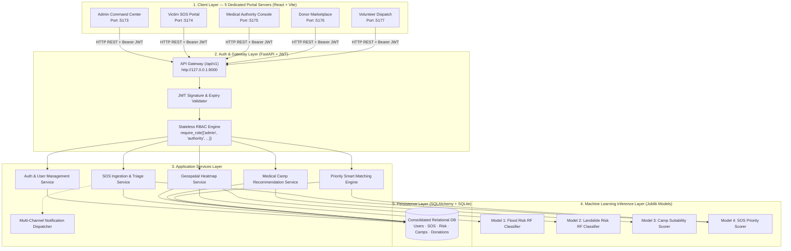

# Disaster Relief Medical Donation Module
## System Documentation & Technical Specification

**Project ID:** `R26-IT-047`
**Degree:** B.Sc. (Hons) in Information Technology — Sri Lanka Institute of Information Technology (SLIIT)
**Component Owner:** Kavitha — *SOS Alerting, Risk Heatmap Optimization & Priority-Based Smart Matching*
**Supervisors:** Mrs. Anjali Gamage (Supervisor) · Ms. Chathurya Kumarapperuma (Co-Supervisor)
**Version:** 1.1.0 · **Date:** August 2026

---

## Documentation Suite Index

| # | Document | Description | Key Artifacts |
| :--: | :--- | :--- | :--- |
| 01 | [System Architecture](./01_system_architecture.md) | 5-layer layered architecture, component boundaries, and request flow. | Layer diagram, Component interaction flow, Tech stack matrix |
| 02 | [RBAC & Security Specification](./02_rbac_and_security.md) | Stateless JWT authentication, role claims, and `require_role()` dependency injection. | RBAC state machine, 5-role access matrix, JWT token lifecycle |
| 03 | [Database Schema & Data Dictionary](./03_database_schema_and_data_dictionary.md) | Consolidated 8-entity relational model, data dictionary, and indexing strategy. | ER diagram, Schema tables, Foreign key graph |
| 04 | [Machine Learning Pipeline & Models](./04_ml_pipeline_and_models.md) | 4 Random Forest models — Flood, Landslide, Camp Suitability, Priority Scorer. | ML pipeline flowchart, Feature importance charts, Performance tables |
| 05 | [REST API Specification](./05_api_specification.md) | Versioned `/api/v1` RESTful contract, Pydantic schemas, and error semantics. | Endpoint inventory, Request/Response payloads, Status code matrix |
| 06 | [Disaster Response Lifecycle](./06_disaster_response_lifecycle.md) | End-to-end operational pipeline from SOS trigger to donor delivery. | Sequence diagram, State transitions, Multi-channel alerting flow |
| 07 | [Testing & Quality Assurance Report](./07_testing_and_qa_report.md) | Unit, integration, and ML inference test cases with in-memory isolation. | Test case matrix, Coverage breakdown, Pytest execution log |
| 08 | [Frontend Architecture & Multi-Portal Deployment Guide](./08_frontend_portal_guide.md) | React 19 SPA with 5 isolated stakeholder portals on dedicated TCP ports. | Portal port map, Component reference, Design system tokens, Startup guide |
| 09 | [Docker Deployment & Orchestration Guide](./09_docker_deployment_guide.md) | Full containerization guide with MySQL 8.0, FastAPI backend, and Adminer web GUI. | Docker Compose architecture, Healthchecks, Environment matrix, CLI helper |
| 10 | [Postman API Testing & Verification Guide](./10_postman_api_testing_guide.md) | Automated 30+ endpoint test suite, dynamic JWT extraction, and Newman CI guide. | Postman Collection, Environment variables, Test matrix, Sequence guide |
| 11 | [Developer Launching & Setup Guide](./11_development_launch_guide.md) | Comprehensive venv setup, dual-terminal launch workflows, and troubleshooting. | venv guide, 2-terminal workflow, Portal map, Run sheet |

---

## High-Level System Overview



---

## Key Architectural Tenets

**1. Role-Based Access Control by Construction**
Authentication and authorization are fully decoupled from domain business logic. Every protected endpoint enforces permissions via stateless JWT claims evaluated by the declarative `Depends(require_role([...]))` guard. Fail-closed semantics guarantee that missing or malformed tokens default to immediate HTTP 401/403 rejection.

**2. Five Isolated Stakeholder Portals**
The React frontend runs as five simultaneously active Vite development servers, each bound to a dedicated TCP port and initializing with the default credentials and UI context for its assigned stakeholder role. Portal detection is automatic — the application inspects `VITE_PORTAL_TYPE`, then window port, then URL path, then query parameter. A single `npm run dev:all` command starts all five servers concurrently.

**3. Explainable Multi-Model AI Pipeline**
Four task-specific Random Forest models operate sequentially:
- **Landslide Model** — 3-tier severity classification from 257 verified Sri Lankan incidents (F₁ = 0.9476)
- **Flood Model** — river basin risk from hydrology, land-use, and infrastructure exposure (F₁ = 0.8694)
- **Camp Model** — optimal medical camp placement regressor (R² = 0.9072)
- **Priority Model** — time-decayed triage urgency scorer (R² = 0.8241)

**4. Stateless Scalability**
No session table lookups on protected routes. JWT tokens embed `user_id` and `role` claims directly, enabling high-throughput, horizontally scalable API operation without distributed session state.

**5. Relational Integrity**
Eight normalized entities enforce strict referential integrity with support for partial donor pledges and multi-victim geographic clusters.

---

## Technology Stack Summary

| Layer | Component | Technology | Rationale |
| :--- | :--- | :--- | :--- |
| **Frontend** | React SPA | React 19 + Vite 8 | Fast HMR, tree-shaking, ES modules |
| **UI Icons** | Icon system | Lucide React | Professional SVG vector icons; zero emoji dependency |
| **Mapping** | GIS layer | Leaflet + React-Leaflet | Lightweight, tile-agnostic, offline-capable |
| **Charts** | Analytics | Chart.js + react-chartjs-2 | Declarative charting with rich animation |
| **API Framework** | REST Backend | FastAPI (Python 3.10+) | Async, native OpenAPI, clean DI for RBAC |
| **Data Persistence** | ORM + DB | SQLAlchemy 2.0 + MySQL 8.0 (Docker) / SQLite (Local) | Strict FK constraints; auto-detecting connection pool engine |
| **Security & Auth** | JWT + Crypto | PyJWT + passlib (bcrypt) | Adaptive bcrypt hashing, stateless claims tokens |
| **Machine Learning** | Training & Inference | scikit-learn + joblib + pandas | Zero-inference overhead; RF suited to tabular disaster data |
| **Testing** | Automated QA | pytest + httpx + TestClient | In-memory SQLite isolation; 27/27 tests passing |

---

## Quick Execution Guide

### Prerequisites

```powershell
# Python 3.10+ and Node.js 18+ are required.
# Verify installed versions:
python --version
node --version
npm --version
```

### 🐳 Docker Quick Start (Recommended)

Start the complete MySQL 8.0 + FastAPI + Adminer stack with a single command:

```powershell
cd "D:\My research\SDM Project refine"

# Start all services in detached mode
docker-compose --env-file .env.docker up --build -d

# Or use the PowerShell helper script
.\docker-start.ps1 up
```

| Service | URL | Purpose |
| :--- | :--- | :--- |
| **FastAPI REST API** | http://localhost:8000 | Core backend engine |
| **Interactive Docs (Swagger)** | http://localhost:8000/api/docs | OpenAPI interactive testing |
| **ReDoc Reference** | http://localhost:8000/api/redoc | Clean technical API reference |
| **Health Liveness Probe** | http://localhost:8000/health | `{"status": "ok"}` |
| **Adminer MySQL Web GUI** | http://localhost:8080 | Visual database browser (`db`, `relief_user`, `relief_pass`) |

---

### Local Development (Without Docker)

> 📘 **Full Developer Guide:** See [11. Developer Launching & Local Environment Setup Guide](./11_development_launch_guide.md) or root [`DEV_LAUNCH_GUIDE.md`](../DEV_LAUNCH_GUIDE.md) for detailed virtual environment troubleshooting, execution policies, and architecture workflows.

### Step 1 — Activate Python Virtual Environment (`venv`)

```powershell
# Windows PowerShell (Recommended):
cd "D:\My research\SDM Project refine\backend"
.\venv\Scripts\Activate.ps1

# Windows Command Prompt:
# venv\Scripts\activate.bat

# Linux / macOS / WSL:
# source venv/bin/activate
```

> If PowerShell blocks script execution, run: `Set-ExecutionPolicy -Scope Process -ExecutionPolicy Bypass`

### Step 2 — Install backend dependencies

```powershell
# Inside active venv:
cd "D:\My research\SDM Project refine\backend"
python -m pip install --upgrade pip
pip install -r requirements.txt
```

### Step 3 — Train or retrain ML models

```powershell
# From project root with venv active:
cd "D:\My research\SDM Project refine"
python ml_pipeline.py
```

> Training is required only once. The four `.joblib` model artifacts are written to `backend/ml_models/` and loaded into memory on API startup.

### Step 4 — Run automated test suite

```powershell
cd "D:\My research\SDM Project refine\backend"
python -m pytest tests/ -v
# Expected: 27 passed in ~16s
```

### Step 5 — Start the FastAPI backend server (Terminal 1)

```powershell
cd "D:\My research\SDM Project refine\backend"
.\venv\Scripts\Activate.ps1
python -m uvicorn app.models.main:app --host 127.0.0.1 --port 8000 --reload
```

| Endpoint | URL |
| :--- | :--- |
| Interactive OpenAPI docs | http://127.0.0.1:8000/api/docs |
| ReDoc technical reference | http://127.0.0.1:8000/api/redoc |
| Liveness health check | http://127.0.0.1:8000/health |

### Step 6 — Install frontend dependencies

```powershell
cd "D:\My research\SDM Project refine\frontend"
npm install
```

### Step 7 — Launch the stakeholder portals (Terminal 2)

**Launch all five portals simultaneously:**
```powershell
cd "D:\My research\SDM Project refine\frontend"
npm run dev:all
```

> `npm run dev:all` executes `start_portals.js`, which spawns five independent Vite processes with color-coded terminal output and coordinated `SIGINT` shutdown.

**Or launch an individual portal:**
```powershell
npm run dev:admin      # Admin Command Center    → http://localhost:5173
npm run dev:victim     # Victim SOS Portal       → http://localhost:5174
npm run dev:authority  # Medical Authority        → http://localhost:5175
npm run dev:donor      # Donor Marketplace        → http://localhost:5176
npm run dev:volunteer  # Volunteer Dispatch       → http://localhost:5177
```

---

## Portal Access Matrix

| Portal | URL | Default Login | Role |
| :--- | :--- | :--- | :--- |
| Admin Command Center | http://localhost:5173 | admin@disaster.relief.lk | admin |
| Victim SOS Portal | http://localhost:5174 | victim@kaduwela.lk | victim |
| Medical Authority Console | http://localhost:5175 | authority@moh.gov.lk | authority |
| Relief Donor Marketplace | http://localhost:5176 | donor@redcross.lk | donor |
| Field Volunteer Dispatch | http://localhost:5177 | volunteer@relief.lk | volunteer |

> Default passwords follow the pattern `<Role>@2026!` (e.g., `Admin@2026!`). These credentials are seeded during database initialization and are intended for development and demonstration environments only.
